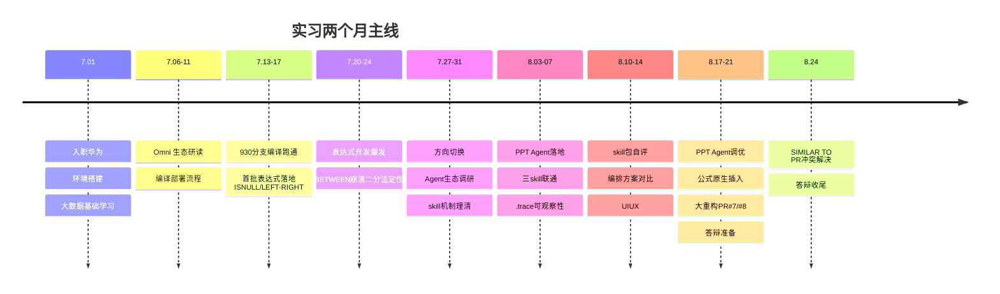

# 实习工作详述 · 实习概述

## 一、实习概述

### 1.1 基本信息

| 项         | 内容                                                            |
| ---------- | --------------------------------------------------------------- |
| 实习单位   | 华为                                                            |
| 入职日期   | 2026-07-01                                                      |
| 部门       | SAIE业务域，Omni 生态（列式存储 / 大数据方向）                  |
| 实习周期   | 2026.07 — 2026.08                                              |
| 工作时间   | 08:30–18:00，净工时 8 小时                                     |
| 大模型环境 | 两套后端：智谱 MAAS（glm 系列）/ 华为 Ascend（deepseek-v4-pro） |

### 1.2 实习目标（五条）

1. 理解项目运作形式
2. 掌握大数据生态（SQL、Spark、Flink）
3. 提升 C++ 开发技能
4. 用 AI Agent 辅助研发实战
5. 参与开源贡献

### 1.3 两个项目定位

| 项目                     | 周期         | 角色                 | 核心工作                                         |
| ------------------------ | ------------ | -------------------- | ------------------------------------------------ |
| OmniStream               | 7月上中旬    | 表达式开发           | SQL 表达式原生加速、bug 修复、编译流程、工具链   |
| AgentOS / PPT-Agentskill | 7月下旬—8月 | 研究员部分开发与调优 | 4 角色流水线落地、可观察性、公式原生插入、大重构 |

### 1.4 主线时间线

---
