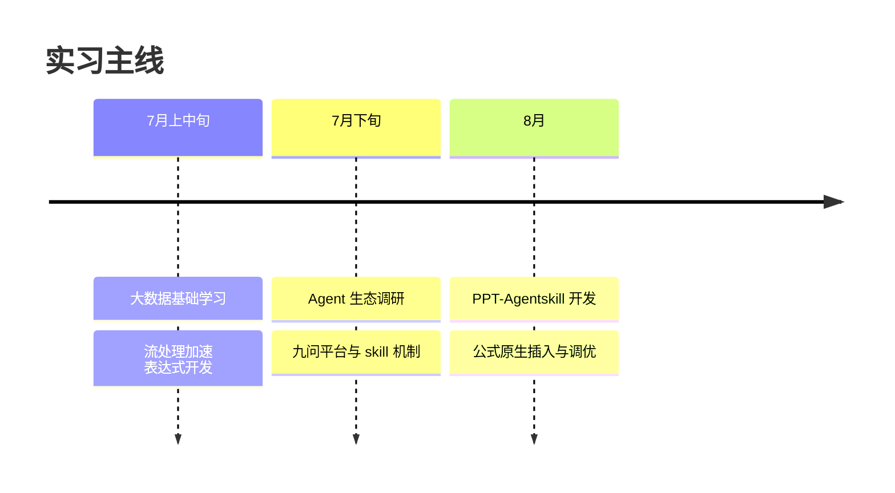
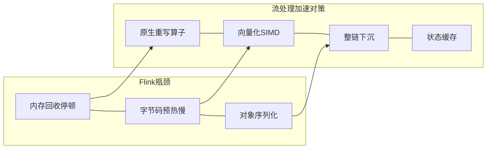
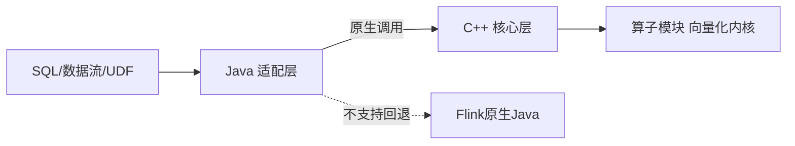
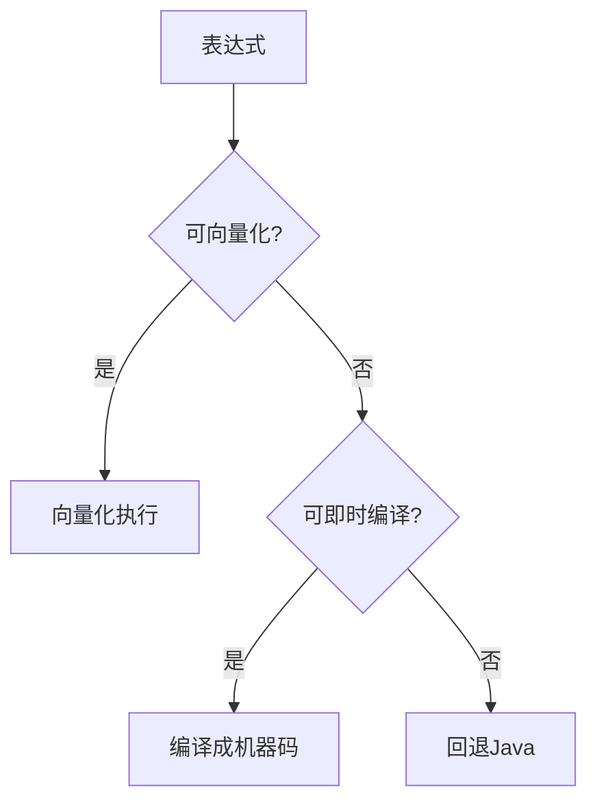
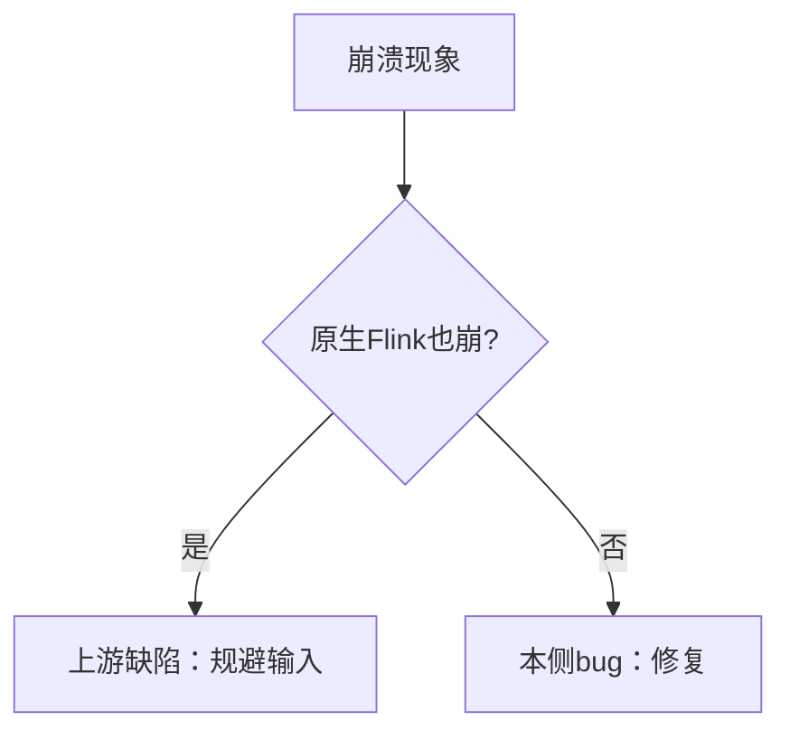
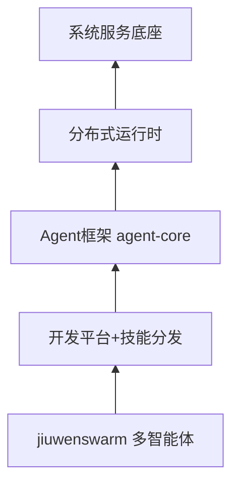
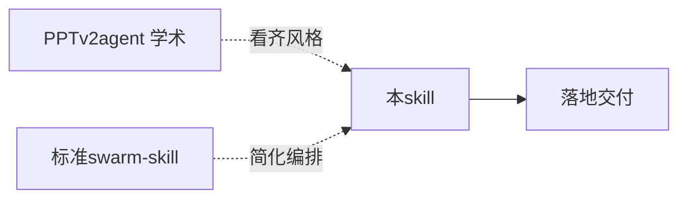
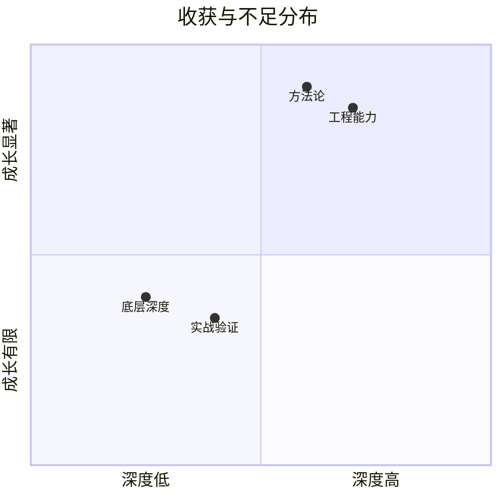

# Slide 1: 封面

# 实习生答辩

**员工**：（待填写）　　**部门**：业务线（软件方向）
**导师**：（待填写）　　**直接主管**：（待填写）
**实习周期**：2026.07 — 2026.08

---

# Slide 2: 目录

本次答辩围绕两个月实习工作，分四部分递进汇报。

1. 自我介绍
2. 学习及工作内容
3. 主要工作输出及总结
4. 自我反思及下一步学习计划

---

# Slide 3: 自我介绍

两个月实习聚焦华为 业务线两个项目，从基础学习切入，逐步深入到开发与工程化。

**教育经历**：2023.09 — 2027.06　华南理工大学　计算机科学与技术

**入职华为**：2026.07.01，业务线 软件方向

**实习目标（五条）**：理解项目运作形式；掌握大数据生态（SQL/Spark/Flink）；提升 C++ 开发技能；用 AI Agent 辅助研发实战；参与开源贡献

---

# Slide 4: 目录

第二部分：学习及工作内容介绍。

---

# Slide 5: 学习及工作内容

学习与工作交织推进：个人相关打基础、建工具链，工作相关出产出、沉淀方法论，两者相互支撑。

<table>
<tr><th>分类</th><th>工作学习任务</th><th>输出和收获</th></tr>
<tr><td rowspan="3">个人相关</td><td>1、大数据基础学习：Flink/Spark 流批架构、状态管理与容错、ARM 生态、电商日志全流程（Flume→Kafka→Spark→Hive）</td><td>建立流处理全貌认知，理解 业务线定位</td></tr>
<tr><td>2、Agent 生态调研：九问 agent-core/swarmflow 原语机制、27 个开源 PPT 方案横向调研（PPTAgent/tencent-pptx/ppt-master 等）</td><td>理清 skill→workflow.md→workflow.py 执行链路</td></tr>
<tr><td>3、开发工具链建设：6 个表达式开发 skill + 构建优化 skill + 审计 skill</td><td>固化"构建→测试→审计"开发流，重复动作一条命令化</td></tr>
<tr><td rowspan="4">工作相关</td><td>1、流处理加速 表达式开发：8 类 SQL 表达式原生化（ISNULL/LEFT-RIGHT/BETWEEN/NOT IN/EXISTS/SIMILAR TO/IFNULL 等）</td><td>10+ 表达式提 PR，走通"设计→实现→提 PR→审计→修复→补测试"全链路</td></tr>
<tr><td>2、流处理加速 bug 修复：filter 路径 BetweenExpr 崩溃、注册名错位、静默回退等</td><td>确立 vanilla 对照组二分法，问题归因有客观依据</td></tr>
<tr><td>3、PPT-Agentskill 开发：researcher 部分、.trace/ 可观察性体系、公式原生插入方案</td><td>4 角色流水线落地，OMML 方案 26 公式 WPS 验证通过</td></tr>
<tr><td>4、PPT-Agentskill 调优：HITL 显式化、大重构 PR #7/#8、纯净原则审计</td><td>产物校验四缺口修复，27 文件纯净审计 15 必修</td></tr>
</table>

---

# Slide 6: 目录

第三部分：主要工作输出及总结。

---

# Slide 7: 流处理加速项目背景

流处理加速 是 开源社区大数据的 Native 加速项目，用原生代码重写 Flink 算子，从根上提升性能。

Flink 跑在虚拟机上，高负载下有三类瓶颈，共同根源是"虚拟机托管执行 + 行式对象模型"：

- **内存回收停顿**：堆上大量对象，Stop-The-World 打断低延迟
- **字节码预热慢**：先解释执行，攒够热点才编译成机器码
- **对象序列化开销**：数据流转与状态读写时对象转字节流，逐条放大

流处理加速 四招对症下药：原生代码重写算子消除虚拟机开销、向量化指令批量计算、整条算子链下沉原生减少跨语言调用、状态缓存降低磁盘 IO。

> 项目属 开源社区大数据运行时优化，适配 Flink 1.16.3，当前版本 1.3.0。

---

# Slide 8: 三仓库双层架构

项目分三个仓库协作：Java 适配层对接 Flink，C++ 核心层执行算子，实现零侵入接入与算子级回退。

| 仓库 | 职责 | 技术栈 | 产物 |
| --- | --- | --- | --- |
| 流处理加速 | 原生运行时框架：Task/算子链/状态/连接器 | C++ + CMake | libtnel.so |
| 适配层 | Flink 桥接：算子替换决策、执行计划注入 | Java | flink-tnel.jar |
| 算子模块 | 底层向量化内核：算子/表达式/150+函数 | C++ + Java JNI | 5×.so + 2×.jar |

端到端链路：SQL → 适配层注入原生描述并决策替换 → 原生任务接管 → 调用核心层算子链 → 向量化内核执行 → 结果回流 Flink。

零侵入：只改两个配置文件，不改 Flink 内核；不支持算子自动回退原生执行，保证完全兼容。

---

# Slide 9: 表达式开发总览

让 Flink SQL 表达式走原生加速路径，是 流处理加速 侧的主要工作。

一条表达式从 SQL 到原生执行经历五阶段生命周期：规划期（识别表达式→JSON 描述）→ 部署期（嵌入算子链）→ 解析期（解析为表达式树）→ 编译期（验证→编译）→ 运行期（批量向量化执行）。

按表达式特点分四类，各有对应开发范式：

| 类型 | 触发 | 改动范围 | 典型 |
| --- | --- | --- | --- |
| A 标量函数 | 标量函数 | 适配层 + 内核 | LEFT/RIGHT |
| B 特殊语法 | 自定义类型 | 适配层 + 内核 | BETWEEN、SIMILAR TO |
| C 聚合函数 | 算子级 | 适配层 + 运行时 + 内核 | STDDEV_POP |
| D SQL 别名 | 函数 | 仅适配层 | IFNULL→COALESCE |

执行路径两条：向量化（预写列函数，覆盖广、无编译依赖）与即时编译（编译成机器码，表达式融合内联）；优先向量化，不行才即时编译，都不行回退 Java。

---

# Slide 10: 表达式开发案例

三个案例覆盖不同开发范式，体现"先分类再选路"的方法。

**IFNULL — 别名映射**：语义等价已有函数 COALESCE，在适配层加一行映射，整链按 COALESCE 走，内核零改动。一行代码完成一个表达式的原生化。

**LEFT/RIGHT — 纯向量化**：镜像的字符串函数，共享同一路径，唯一差异在切片算法。按 UTF-8 码点步进，绝不切断多字节字符；空值由框架自动传播。

**BETWEEN vs SIMILAR TO — 两种策略**：BETWEEN 语义可拆成两个不大于判断组合执行；SIMILAR TO 是正则不可拆，需专用函数解释。判据：每行算要不要整批共享昂贵预处理？要→专用函数，不要→借原语。

| 案例 | 范式 | 要点 |
| --- | --- | --- |
| IFNULL | 别名映射 | 一行映射，零改动复用 |
| LEFT/RIGHT | 纯向量化 | Unicode 安全，码点不截断 |
| BETWEEN | 借原语编译 | 语义可拆，组合执行 |
| SIMILAR TO | 专用函数解释 | 正则不可拆，批级缓存 |

---

# Slide 11: 问题排查与方法论

BETWEEN 崩溃排查确立了"用原生 Flink 做对照组"的二分法，让问题归因有客观依据。

**问题**：BETWEEN 在反向区间（下界大于上界）和 SYMMETRIC 语义下崩溃，但不确定是上游 Flink 缺陷还是本侧实现 bug。

**方法**：把同一用例同时跑在原生 Flink 与 native实现上对比：

- **投影路径**：原生 Flink 也崩，异常栈在 Calcite 空集处理，属 Flink 1.16.3 源码缺陷，与本项目无关 → 测试主动规避这类输入
- **过滤路径**：原生 Flink 正常而 native 崩，根因是过滤算子生成 BETWEEN 表达式时崩溃 → 本侧 bug，修复

**方法论**：原生也崩 = 上游问题（规避，测试不做 golden）；原生正常而 native 崩 = 本侧 bug（修复）。不把时间浪费在错误的目标上。

过程中还解决了注册名大小写敏感、Sink 类型限制致静默回退、新表达式类致 ABI 破坏须重编、三端类型 ID 错位等多个工程问题，均沉淀进 6 个开发 skill 与 106 篇教程文档。

---

# Slide 12: AgentOS项目背景

基于九问（openJiuwen）Agent 平台开发一体机办公 Agent，核心约束是产物必须可编辑。

九问平台提供 Agent 全生命周期开发与运行能力，自底向上五层：系统服务（安全沙箱/记忆）→ 分布式运行时 → Agent 框架（agent-core）→ 开发平台与技能分发 → 开箱即用智能体（jiuwenswarm 多智能体协同旗舰）。

一体机办公 Agent 把大模型能力做成本地化、可编辑交付的办公智能体。三个关键约束决定后续所有选型：

- **产物必须可编辑**（中文办公刚需）→ Python PPT 库主路线；Markdown 框架导出的 PPTX 均为图片型不可编辑
- **本地化部署** → 接一体机模型降本
- **WPS 兼容** → 渲染是硬约束，直接催生公式原生插入核心难题

---

# Slide 13: 4角色流水线架构

PPT-Agentskill 是九问平台上的 4 角色专门化流水线，强制分工与校验，解决单 Agent 生成浅、未校验、视觉不一致的失败模式。

四个角色各司其职：附件提取 → 大纲规划 → 文稿研究 → 视觉设计。每阶段产物有固定路径与脚本校验，且不得修改上游产物，只增强/标注。

**双层质量保证**：脚本硬校验（结构/路径/产物，确定性不漏）+ LLM 自审（语义/质量）。脚本管结构，LLM 管语义。

**可观察性**：每个阶段、每个 Agent 调用都在工作区 .trace/ 目录下按阶段编号落盘完整返回，附 manifest.json 审计汇总。关键约束：只读旁路，不改变控制流——观测不能改变被观测对象行为，否则 trace 不可信。

> 研究员角色负责调研信息、写文稿、自审，产出信息美学 Markdown，原生表格与公式保持可编辑。

---

# Slide 14: PPTv2agent参考

参考 PPTAgent v2（DeepPresenter）学术方法，看齐其内容风格。

PPTAgent v2 是当前学术 SOTA（评测均分 4.44，超越商业系统 Gamma 的 4.36），双 Agent 协作加渲染反思。其"信息美学"内容风格五条是研究员提示词看齐的对象：

1. 信息加工成半成品而非原材料，信息图为视觉焦点
2. 每页围绕一个核心洞察，深度分析提炼高价值结论
3. 金字塔原则，主题句领起
4. 图片承载信息而非填空，禁通用商务占位图
5. 优先可信来源（arxiv/wikipedia/官方/权威媒体）

| 项 | PPTv2agent | PPT-Agentskill |
| --- | --- | --- |
| 定位 | 学术方法 | 平台工程落地 |
| 编排 | 双 Agent 渲染反思 | 4 角色流水线 |
| 反思 | 渲染像素图反馈 | 脚本校验 + 终态验证 |
| 关系 | 看齐对象 | 落地实现 |

> 设计器引擎源自 PPTAgent v2 提取重写为独立 CLI，内容风格看齐进研究员/设计器提示词层。

---

# Slide 15: skill框架比较

本 skill 相比标准多角色形态和学术方法各有取舍，选型依据场景。

**相比标准 swarm-skill**：标准形态用工具加载可执行脚本跑原语编排；本 skill 简化为手动编排（建队→派角色→建任务依赖），更适合固定流水线与断点续跑。人机交互用转达协议（标记前缀让队长识别"必须转达"）替代原语。

**相比 PPTAgent v2**：学术方法是双 Agent 反思；本 skill 是平台上的工程实现，4 角色分工加脚本校验。设计器引擎源自其提取重写。

| 维度 | 标准 swarm-skill | 本 skill | PPTv2agent |
| --- | --- | --- | --- |
| 编排 | 工具跑原语 | 手动建队编排 | 双 Agent 反思 |
| 质量门 | 脚本内嵌 | 脚本+LLM 双层 | 渲染像素反馈 |
| 人机交互 | 原语 | 转达协议 | — |

> 选型依据：固定流水线 + 断点续跑 + 预算控制 → 编排式；一人用 + 流程灵活 → 单 Agent 自包含。

---

# Slide 16: 公式原生插入问题

把公式做成可编辑的原生方程而非图片，是本项目的核心难题。

**需求**：中文办公场景公式必须可编辑（非图片截图），且 WPS 兼容是硬约束。

**三大根因**：

1. **Python PPT 库不支持原生公式** — 官方 issue 自 2019 年至今未解决，无原生公式注入能力
2. **PowerPoint 特有包装** — 需要特殊命名空间包装器（Word 不需要），命名空间地址必须精确
3. **WPS 渲染陷阱** — 不渲染直立属性（文字命令包裹仍斜体）、不认某些包装、缺特定字体不显示

**四次方案迭代**：

| 轮次 | 方案 | 结果 |
| --- | --- | --- |
| 1 | 转图片 | 全兼容但不可编辑，96KB，需启动浏览器截图 |
| 2 | 转换库生成 | WPS 不渲染（包装错 + 命名空间错 + 嵌套干扰） |
| 3 | 重型工具 | 150MB 太重，许可证不明 |
| 4 | 手写解析器 | WPS 可见，零新依赖，32KB |

---

# Slide 17: 公式原生插入方案

最终方案手写递归下降解析器直接生成原生公式，全链路打通且零新增依赖。

**全链路**：文稿写公式（按识别规范判定哪些用公式标记、哪些纯文本）→ 设计器标记 → 收集 → 后处理注入原生方程。

**XML 结构**（WPS 已验证可见）：段落 → 特殊包装 → 公式段落 → 公式体 → 各元素（分数/根号/上下标）。每个运算行加特定字体；不用兼容包装；块公式显式对齐解决 WPS 不认默认对齐的坑。

**验证结果**：8 种公式类型 + 26 个文稿公式全部注入成功；WPS 可见性确认；文件 32KB（vs 图片 96KB，更小）；零新增依赖（复用已有库 + 标准库）。

**配套保障**：公式识别规范决策表（9 类 + 决策树，判定何时用公式标记、何时纯文本）+ 校验脚本硬阻断（拦截文字命令内多字母词违规），从源头保证可正确注入。

> 不支持的命令降级为友好文本（如分数→(a)/(b)，根号→√(x)），非原始源码，命令名可能泄漏已文档化。

---

# Slide 18: Wiki产出

两个月沉淀 21 篇文稿约 34 万字符，分四类覆盖机制解读、调研选型、评测原则与工程审计。

| 分类 | 篇数 | 内容 |
| --- | --- | --- |
| 基础学习 | 5 | PPTAgent 框架解析、提示词提取、Swarm Skill 生命周期、原语机制、tencent-pptx 分析 |
| 知识拓展 | 6 | 流水线组装选型、样式模板调研、文字约束调研、公式插入调研、公式方案评估三联 |
| 工作指南 | 2 | 评测 30 条检查项与生成策略、三角色产物通用设计原则 |
| 工程实践 | 8 | 4 分支审计 + CSS 模板库 + 自检独立化 + 27 文件纯净审计 |

**核心数据**：8 个分支/工作区审计，50+ commit 可追溯；5 个开源项目横向调研；公式方案 26 公式端到端验证；12 套 CSS 模板确定性物化；预检快检 0.38ms（vs 全检 700ms，快 1800 倍）。

> 每篇审计记录改动可追溯到提交，涵盖清理、看齐、需求对齐、版式配色分离、公式、声明式页型、产物校验四缺口修复。

---

# Slide 19: 目录

第四部分：自我反思及下一步学习计划。

---

# Slide 20: 收获与不足

工程能力与方法论显著成长，底层深度与实战验证仍是短板。

**收获**：

- 代码开发能力提高：C++ 大数据开发全链路（编译/测试/提 PR/审计），Agent 工程化（skill 驱动/可观察性/质量保障）
- 方法论沉淀：vanilla 对照组二分法（bug 归因）、只读旁路可观察性（.trace/）、纯净原则审计清单（4 大类 16 项）
- 认知升级：skill 是声明单元也是行为约束；隐式交互脆弱，显式强约束才可靠；"看起来完整" ≠ "真的能用"

**不足**：

- 工程编码能力仍需提升，底层向量化内核与编译器实现了解不够清楚
- skill 包最大缺口是零实战验证，Steps 是最佳实践陈述而非真实会话提炼
- 8 月切入 Agent 项目后 流处理加速 深度推进受限，时间分配需优化

---

# Slide 21: 下一步学习计划

围绕三个方向继续提升。

1. **冲刺可信认证专业级**：进一步提高编码能力与工程规范素养，通过专业级认证
2. **底层存储深入**：深入向量化内核与编译器实现，补齐底层深度短板
3. **Agent 工程化深化**：推进 skill 包实战验证（补 case study 与已知限制说明），深化公式原生插入的矩阵/方程组/重音支持

---

# Slide 22: 致谢

感谢在座的评委、各位领导百忙中抽出时间参与本次答辩！

感谢导师、直接主管与周围同事的指导与帮助！

感谢所有给予过帮助指导和工作支持的人们！
