# 实习生答辩

员工：田沛康                                           部门：SAIE业务域
导师：向云武		      	       直接主管：李兆星
Security Level:

### Notes:

---

# 目录

1
自我介绍

2

学习及工作内容

3

主要工作输出及总结

4

自我反思及下一步学习计划

### Notes:

本次答辩分四部分递进汇报。

---

# 自我介绍

教育经历
2023.09 - 2027.06
华南理工大学  计算机科学与技术

工作经历
2026.07 - 至今
华为  Omni生态 大数据方向

入职华为
2026.07.01
SAIE业务域（ICT BG) AI应用工程师

### Notes:

本次答辩汇报两个月实习工作。实习聚焦华为Omni生态两个项目：7月上中旬OmniStream表达式开发，7月下旬至8月AgentOS的PPT-Agentskill开发。从大数据基础学习切入，逐步深入到Native算子开发与Agent工程化。

---

# 目录

1
自我介绍

2

学习及工作内容

3

主要工作输出及总结

4

自我反思及下一步学习计划

### Notes:

第二部分：学习及工作内容介绍。

---

学习及工作内容介绍

| 分类     | 工作学习任务                                                                                                                                                                                                           | 输出和收获                                                                                                                               |
| -------- | ---------------------------------------------------------------------------------------------------------------------------------------------------------------------------------------------------------------------- | ---------------------------------------------------------------------------------------------------------------------------------------- |
| 个人相关 | 1、大数据基础学习（Flink/Spark/鲲鹏920 ARM生态） 2、电商日志全流程（Flume→Kafka→Spark→Hive） 3、Agent生态调研（九问平台、27方案） 4、开发工具链建设（6+构建+审计skill）                                             | 建立流处理全貌认知 走通编译部署全流程 形成完整编译地图 理清skill→workflow执行链路 固化构建→测试→审计一条命令化                        |
| 工作相关 | 1、OmniStream 8类SQL表达式原生化（ISNULL/LEFT-RIGHT/BETWEEN/NOT IN/EXISTS/SIMILAR TO等） 2、bug修复（BetweenExpr崩溃/注册名错位/静默回退） 3、PPT-Agentskill开发与调优（4角色流水线/.trace/公式原生插入/大重构PR#7#8） | 10+表达式提PR 走通设计→审计→修复全链路 确立vanilla对照组二分法 4角色流水线落地 26公式WPS验证通过 27文件纯净审计15必修 21篇Wiki约34万字 |

Page

### Notes:

学习与工作交织推进。个人相关打基础：大数据基础学习建立流处理全貌认知，Agent生态调研理清skill驱动机制，开发工具链固化一条命令化。工作相关出产出：OmniStream 8类表达式原生化10+提PR，bug修复确立vanilla二分法，PPT-Agentskill 4角色流水线落地加26公式WPS验证，调优完成HITL显式化与大重构PR#7#8及27文件纯净审计15必修。21篇Wiki约34万字沉淀全程。

---

# 目录

1
自我介绍

2

学习及工作内容

3

主要工作输出及总结

4

自我反思及下一步学习计划

### Notes:

第三部分：主要工作输出及总结。

---

项目背景： OmniStream--基于Flink生态的流处理性能加速项目

- GC 停顿：JVM 堆对象 GC 时 Stop-The-World
- JIT 预热：字节码先解释执行，攒够热点才编译
- 序列化开销：Java 对象转字节流，逐条放大

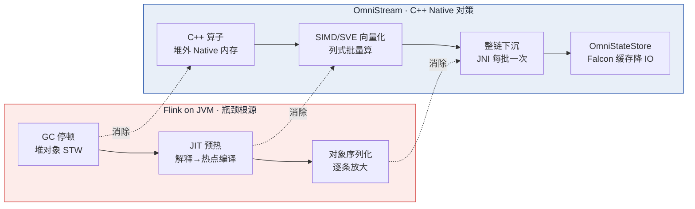

OmniStream 是 openEuler + 鲲鹏 BoostKit 大数据 OmniRuntime 生态中面向 Flink 的 Native 化加速项目。核心思路是用 C/C++ 重写 Flink 的 SQL 与 DataStream 算子，配合 AArch64 SIMD/SVE 向量化指令，在不改 Flink 一行代码的前提下端到端提升性能。三瓶颈的共同根源是"JVM 托管执行 + 行式对象模型"，四招对症下药：C++ 写算子消除 JVM 开销、SIMD 列式批量算、整条算子链下沉 Native 减少 JNI 往返、OmniStateStore 缓存降低 RocksDB 磁盘 IO。适配 Flink 1.16.3，当前版本 1.3.0。

### Notes:

OmniStream是openEuler社区、华为鲲鹏BoostKit大数据OmniRuntime生态中面向Apache Flink的流计算Native化加速项目。核心思路是用C/C++重写Flink的SQL与DataStream算子，配合鲲鹏AArch64的SIMD向量化指令，在不改Flink一行代码的前提下端到端提升性能。Flink跑在JVM上，高负载下有三类瓶颈：GC停顿打断低延迟、字节码先解释执行预热慢、对象序列化开销大。共同根源是"JVM托管执行+行式对象模型"。OmniStream四招对症下药：C++写算子消除JVM开销、SIMD向量化批量算、整条算子链下沉Native减少JNI往返、状态缓存降低RocksDB磁盘IO。项目适配Flink 1.16.3，当前版本1.3.0。

---

三仓库双层架构：Java适配层 + C++核心层

- Java 适配层：拦执行计划 / 判 Native 化 / JNI 初始化 / 不支持回退
- C++ 核心层：算子、状态、数据流、连接器全在 C++ 闭环
- 零侵入接入：只改两个配置文件，不改 Flink 内核代码

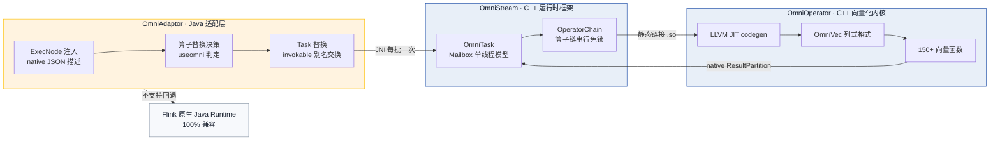

端到端链路：Flink SQL → OmniAdaptor 在 ExecNode 注入 native JSON 描述并决策算子替换 → OmniTask 替换 invokable class → JNI 调 libtnel.so → C++ Mailbox 驱动算子链 → 经静态链接的 OmniOperator .so 调用向量化内核 → 结果经 native ResultPartition 回流 Flink 网络。JNI 桥接层含 25 个头文件 + 5 个 Bridge 实现类，正向调入算子、反向回调 Checkpoint 物化。

### Notes:

项目分三个仓库协作。Java适配层对接Flink，负责拦执行计划、判断能不能Native化、JNI初始化、不支持就回退。C++核心层执行算子，包含完整的运行时框架。端到端链路：SQL → 适配层注入原生描述并决策替换 → 原生任务接管 → 调用核心层算子链 → 向量化内核执行 → 结果回流Flink。零侵入接入是关键设计：只改两个配置文件，不改Flink内核代码。不支持的算子自动回退Flink原生Java执行，保证完全兼容。

---

表达式开发总览：让SQL表达式走Native加速路径

- 5 阶段生命周期：规划 → 部署 → 解析 → 编译 → 运行
- 四类分类体系：Type A 标量函数 / Type B 特殊语法 / Type C 聚合 / Type D 别名
- 选路公式：优先向量化，不行才 codegen，都不行回退 Java

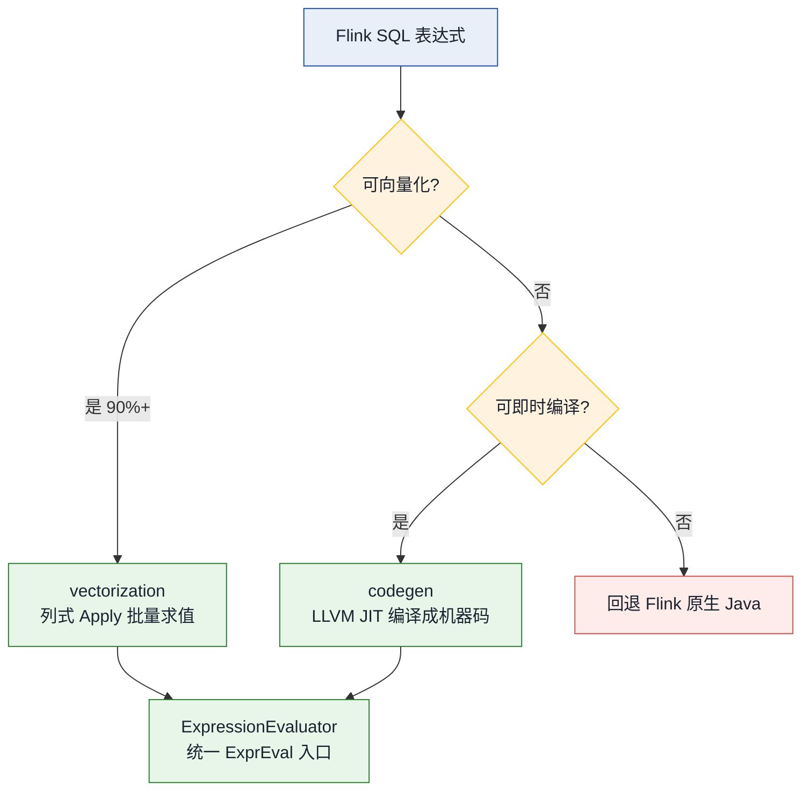

选路公式：`useCodegen = !(preferVectorization && isSupportVectorization) && isSupportCodegen`。向量化（vectorization/functions/*）是预写列函数 Apply 在列批次上求值，无 JIT 依赖、覆盖广；codegen 是 LLVM JIT 把表达式树编译成机器码，支持表达式融合与内联自动 SIMD。一条表达式从 SQL 到 Native 执行经历五阶段：规划期 RexNodeUtil 识别表达式翻译 JSON AST → 部署期嵌入算子链序列化 JobGraph → 解析期 StreamCalcBatch 的 JSONParser::ParseJSON 转 Expr 树 → 编译期 ExprVerifier 验证后 LLVM CodeGen → 运行期 FilterFunc/ProjFunc 批量向量化执行。

### Notes:

表达式开发就是让Flink SQL中的表达式走OmniStream Native向量化执行路径，替代Flink原生Java执行。一条表达式从SQL到Native执行经历五阶段：规划期识别表达式翻译JSON、部署期嵌入算子链、解析期转表达式树、编译期验证并编译、运行期批量向量化执行。按表达式特点分四类：Type A标量函数、Type B特殊语法、Type C聚合函数、Type D SQL别名。每类有对应开发范式。执行路径两条：向量化（预写列函数覆盖广）与即时编译（编译成机器码表达式融合）。优先向量化，不行才即时编译，都不行回退Java。

---

表达式开发案例：三类范式覆盖

| 案例       | 范式       | 要点                    |
| ---------- | ---------- | ----------------------- |
| IFNULL     | 别名映射   | 一行代码完成原生化      |
| LEFT/RIGHT | 纯向量化   | Unicode安全，码点不截断 |
| BETWEEN    | 借原语编译 | 语义可拆，组合执行      |

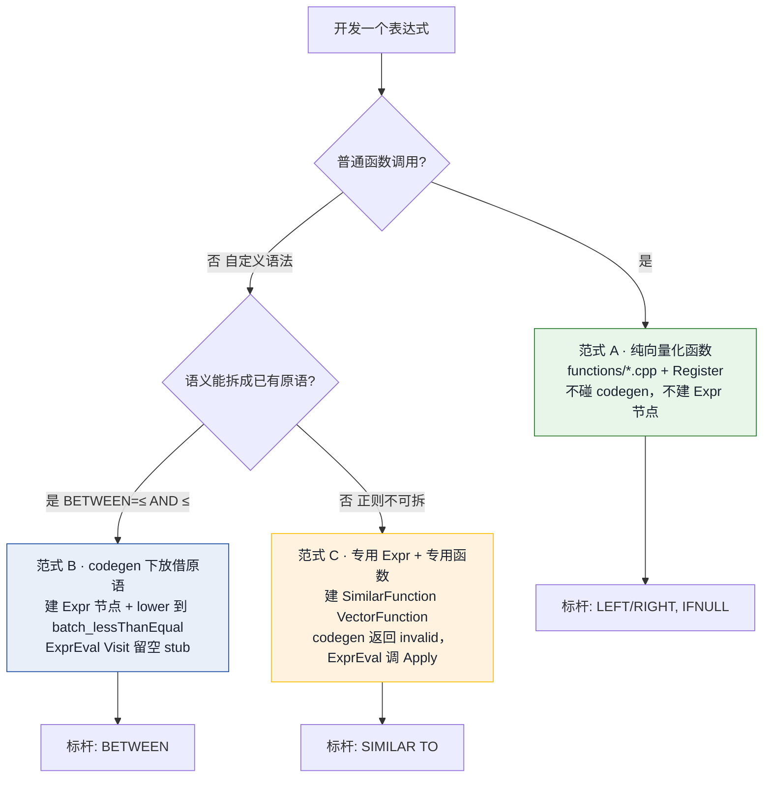

三范式判据速记：能拆成已有原语 → 借原语（范式 B，改 codegen，省一个函数但需写 lower 逻辑）；拆不开 → 造函数（范式 C，写 functions/ + 注册，codegen 只需 stub）；普通函数 → 造函数（范式 A，连 Expr 节点都不用建）。IFNULL 语义等价两参 COALESCE，在 specialOperatorMap 加一行映射整链按 COALESCE 走，内核零改动；LEFT/RIGHT 按 UTF-8 码点步进切片绝不切断多字节字符，NULL 由 SimpleFunction 框架 IntersectNull 自动传播；BETWEEN 借 batch_lessThanEqual × 2 + batch_and 组合执行；SIMILAR TO 的正则全匹配引擎无现成原语，造 SimilarFunction 让解释器批量调 Apply。

### Notes:

三个案例覆盖不同开发范式。IFNULL语义等价两参COALESCE，在适配层加一行映射，整链按COALESCE走，内核零改动。一行代码完成一个表达式的原生化。LEFT和RIGHT是镜像的真正native字符串函数，按UTF-8码点步进切片，绝不切断多字节字符。空值由框架自动传播。BETWEEN的语义能拆成两个不大于判断，借已有向量化原语组合执行，不需要新写函数。SIMILAR TO是正则不可拆，需专用函数解释执行。

---

问题排查：BETWEEN崩溃定位与vanilla对照组二分法

- 问题：BETWEEN 在反向区间 low > high 时崩溃
- 方法：同一用例同时跑原生 Flink 与 native 对比
- 价值：让"甩锅还是背锅"有客观依据

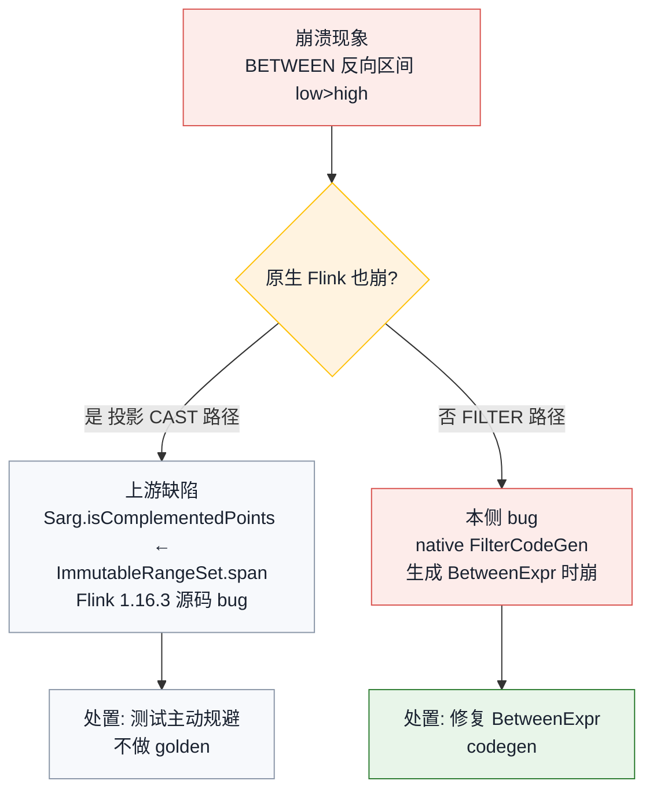

开发 BETWEEN 时发现崩溃，但不确定是 Flink/Calcite 上游缺陷还是本侧 native 实现 bug。用 vanilla 做对照组二分法：投影 CAST 路径 vanilla 也崩，异常栈定位到 Flink 1.16.3 源码 Sarg.isComplementedPoints，与 Omni 无关，测试主动规避这类输入；FILTER 路径 vanilla 正常而 native 崩，根因是 native FilterCodeGen 生成 BetweenExpr 时崩，属本侧 bug 已修复。过程中还解决注册名大小写敏感、静默回退、类型错位等工程问题，均沉淀进开发工具与文档。

### Notes:

开发BETWEEN时发现崩溃，但不确定是Flink/Calcite上游缺陷还是本侧native实现bug。用vanilla也就是原生Flink做对照组：把同一用例同时跑在原生Flink与Omni原生实现上对比。原生也崩说明是Flink 1.16.3源码缺陷，与Omni无关，测试主动规避这类输入。原生正常而Omni崩说明是本侧bug，修复。这让"甩锅还是背锅"有了客观依据。过程中还解决了注册名大小写敏感、静默回退、类型错位等多个工程问题，均沉淀进开发工具与文档。

---

项目背景： AgentOS--一体机办公Agent与PPT-Agentskill

- 定位：基于九问 Agent 平台开发一体机办公 Agent
- 目标：把大模型能力做成本地化、可编辑交付的办公智能体
- 硬约束：WPS 兼容性催生公式原生插入核心难题

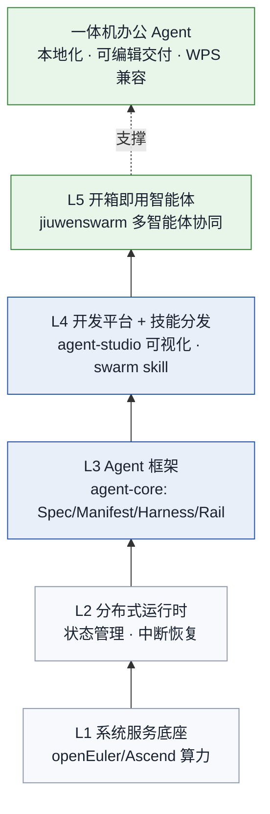

AgentOS 即九问 Agent 平台，提供 Agent 全生命周期"开发 + 运行 + 部署 + 运维"能力，自底向上五层：系统服务底座 → 分布式运行时 → Agent 框架（agent-core：Spec 声明规格 / Manifest 装配清单 / Harness 运行时装配 / Rail 护栏校验）→ 开发平台与技能分发（agent-studio 可视化 + swarm skill 五件套）→ 开箱即用智能体（jiuwenswarm 多智能体协同旗舰）。一体机办公 Agent 把大模型能力做成本地化、可编辑交付的办公智能体，产物必须可编辑是中文办公刚需（走原生 PPT 路线而非图片型导出），本地化部署接一体机模型降本。

### Notes:

AgentOS即openJiuwen九问Agent平台，提供Agent全生命周期开发与运行能力，自底向上五层：系统服务底座→分布式运行时→Agent框架→开发平台与技能分发→开箱即用智能体。一体机办公Agent把大模型能力做成本地化、可编辑交付的办公智能体。产物必须可编辑是中文办公刚需，走原生PPT路线而非图片型导出。本地化部署接一体机模型降本。

---

4角色流水线架构：attachment-reader → planner → researcher → designer

- 4 角色各司其职，强制分工与校验
- 双层质量保证：脚本硬校验（结构）+ LLM 自审（语义）
- 只读约束：每阶段不得修改上游产物，只增强/标注

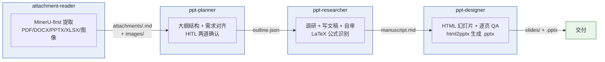

PPT-Agentskill 是九问平台上的 4 角色专门化流水线（C-pattern pipeline）。单一失败模式是单 agent PPT 生成产出浅、未校验、视觉不一致——一个 agent 无法同时精通文档提取、结构规划、深度研究与视觉设计。Pipeline 强制专门化、校验、用户确认检查点：每阶段产物有固定路径与脚本校验（planner 的 finalize.py 验 JSON 结构 / researcher 的 inspect_manuscript.py + finalize_check.py / designer 的 inspect_slide.py + verify_deck.py），且不得修改上游产物。双层质量保证：脚本硬校验管结构，LLM 自审管语义。还设计了 .trace/ 可观察性体系：每个阶段每个 agent 调用都在工作区按阶段编号落盘完整返回，只读旁路不改变控制流。

### Notes:

PPT-Agentskill是九问平台上的4角色专门化流水线。单一失败模式是单agent PPT生成产出浅、未校验、视觉不一致——一个agent无法同时精通文档提取、结构规划、深度研究与视觉设计。Pipeline强制专门化、校验、用户确认检查点。四个角色：附件提取→大纲规划→文稿研究→视觉设计。每阶段产物有固定路径与脚本校验，且不得修改上游产物。双层质量保证：脚本硬校验管结构，LLM自审管语义。还设计了.trace/可观察性体系：每个阶段每个agent调用都在工作区按阶段编号落盘完整返回，只读旁路不改变控制流。

---

PPTv2agent参考：DeepPresenter双Agent架构与Content Style

- DeepPresenter：ACL2026 SOTA（均分 4.44 超 Gamma 4.36）
- 双 Agent 共享观察空间 + 环境接地反思
- 定位：学术参考方法论，PPT-Agentskill 是工程落地

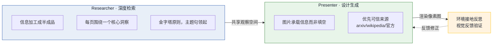

DeepPresenter（PPTAgent v2）是当前学术 SOTA，评测均分 4.44 超越商业系统 Gamma 的 4.36。架构为 Researcher + Presenter 双 Agent 共享观察空间，加环境接地反思——渲染成像素图反馈修正。看齐其信息美学内容风格五条：信息加工成半成品而非原材料、每页围绕一个核心洞察、金字塔原则主题句领起、图片承载信息而非填空、优先可信来源（arxiv/wikipedia/官方）。它是学术参考方法论，PPT-Agentskill 是在九问平台上落地的工程实现，设计器引擎源自其提取重写为独立 CLI。

### Notes:

PPTv2agent即PPTAgent v2又称DeepPresenter，是当前学术SOTA，评测均分4.44超越商业系统Gamma的4.36。架构为Researcher加Presenter双agent共享观察空间，加环境接地反思——渲染成像素图反馈修正。看齐其信息美学内容风格五条：信息加工成半成品而非原材料、每页围绕一个核心洞察、金字塔原则主题句领起、图片承载信息而非填空、优先可信来源。它是学术参考方法论，PPT-Agentskill是在九问平台上落地的工程实现。设计器引擎源自其提取重写为独立CLI。

---

skill框架比较：ppt-pipeline-swarm vs 标准swarm-skill vs PPTv2agent

| 维度     | 标准swarm-skill | ppt-pipeline-swarm |
| -------- | --------------- | ------------------ |
| 编排     | 工具跑原语      | 手动建队编排       |
| 质量门   | 脚本内嵌        | 脚本+LLM双层       |
| 人机交互 | 原语            | 转达协议           |

- 相比标准形态：简化为手动编排，适合固定流水线
- 相比 PPTv2agent：平台上的工程实现，非学术方法
- 设计器引擎源自 PPTAgent v2 提取重写为独立 CLI

本 skill 相比标准多角色 skill 简化为手动编排，更适合固定流水线与断点续跑。人机交互用转达协议——标记前缀让队长识别必须转达，替代原语。相比 PPTAgent v2 学术方法是双 Agent 反思，本 skill 是平台上的工程实现，4 角色分工加脚本校验。选型依据：固定流水线加断点续跑走编排式，一人用加流程灵活走单 agent 自包含。

---

项目背景： 公式原生插入--可编辑OMML方程而非图片

- 需求：公式必须可编辑，WPS 兼容
- 根因：Python PPT 库不支持原生公式（2019 至今未解决）

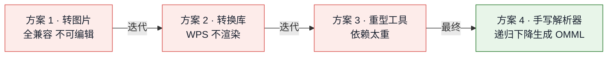

把公式做成可编辑的原生方程而非图片，是本项目的核心难题。中文办公场景公式必须可编辑非图片截图，且 WPS 兼容是硬约束。三大根因：Python PPT 库不支持原生公式自 2019 至今未解决、PowerPoint 需特殊命名空间包装、WPS 渲染有多个兼容陷阱（不渲染直立体、不认某些包装）。方案经历四次迭代：转图片全兼容但不可编辑、转换库生成 WPS 不渲染、重型工具太重、最终手写递归下降解析器直接生成原生公式 XML，WPS 已验证可见。

### Notes:

把公式做成可编辑的原生方程而非图片，是本项目的核心难题。中文办公场景公式必须可编辑非图片截图，且WPS兼容是硬约束。三大根因：Python PPT库不支持原生公式自2019年至今未解决、PowerPoint需特殊命名空间包装、WPS渲染有多个兼容陷阱。方案经历四次迭代：转图片全兼容但不可编辑、转换库生成WPS不渲染、重型工具太重、最终手写递归下降解析器直接生成原生公式，WPS已验证可见。

---

产出：公式原生插入方案与验证

- 手写解析器：递归下降直接生成 OMML
- 验证结果：26 公式全部成功，WPS 可见
- 零新增依赖：复用已有库，文件更小 32KB vs 96KB

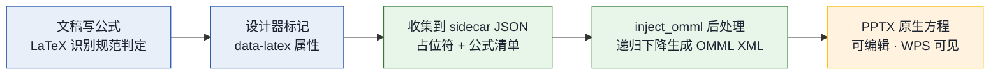

最终方案手写递归下降解析器直接生成原生公式 XML，全链路打通且零新增依赖。链路：文稿写公式按识别规范判定 → 设计器用 data-latex 标记 → html2pptx 收集到 sidecar JSON（占位符 + 公式清单）→ build_deck 调 inject_omml 后处理注入原生方程。验证结果：8 种公式类型加 26 个文稿公式全部注入成功，WPS 可见性确认，文件 32KB 远小于图片方案的 96KB。配套公式识别规范决策表与校验脚本从源头保证可正确注入，不支持命令降级为友好文本（如分数变成括号形式）。

### Notes:

最终方案手写递归下降解析器直接生成原生公式XML，全链路打通且零新增依赖。链路：文稿写公式按识别规范判定→设计器标记→收集→后处理注入原生方程。验证结果：8种公式类型加26个文稿公式全部注入成功，WPS可见性确认，文件32KB远小于图片方案的96KB。配套公式识别规范决策表与校验脚本，从源头保证可正确注入。不支持命令降级为友好文本如分数变成括号形式。

---

Wiki产出：工作指南、知识拓展、基础学习、工程实践21篇

- 基础学习 5 篇：PPTAgent 框架解析、九问 skill 机制、swarmflow 原语
- 知识拓展 6 篇：4 种组装方式选型、公式插入 8 项目对比、样式模板调研
- 工程实践 8 篇：4 分支审计 + 纯净性总结，50+ commit 可追溯

除了项目设计文档和直接代码产出，两个月还沉淀了 21 篇 Wiki 文稿约 34 万字，分四类。基础学习 5 篇解读开源框架平台的内部机制，为项目设计提供底层认知；知识拓展 6 篇横向调研参考项目，为技术选型提供对比依据；工作指南 2 篇从评测标准反推生成策略；工程实践 8 篇记录每次改动的根因、原则、验证，每条改动可追溯到提交。核心数据：8 个分支审计 50 多个提交可追溯，5 个开源项目横向调研，公式方案 26 公式端到端验证，12 套 CSS 模板确定性物化。

### Notes:

除了项目上设计文档和直接代码产出，两个月还沉淀了21篇Wiki文稿约34万字，分四类。基础学习5篇解读开源框架平台的内部机制，为项目设计提供底层认知。知识拓展6篇横向调研参考项目，为技术选型提供对比依据。工作指南2篇从评测标准反推生成策略。工程实践8篇记录每次改动的根因、原则、验证，每条改动可追溯到提交。核心数据：8个分支审计50多个提交可追溯，5个开源项目横向调研，公式方案26公式端到端验证。

---

# 目录

1
自我介绍

2

学习及工作内容

3

主要工作输出及总结

4

自我反思及下一步学习计划

### Notes:

第四部分：自我反思及下一步学习计划。

---

# 收获和体会/有待改进之处

- 收获：方法论沉淀（vanilla 二分法、只读旁路、纯净原则审计）
- 收获：工程化思维与代码开发能力提高
- 不足：底层向量化内核与编译器实现了解不够

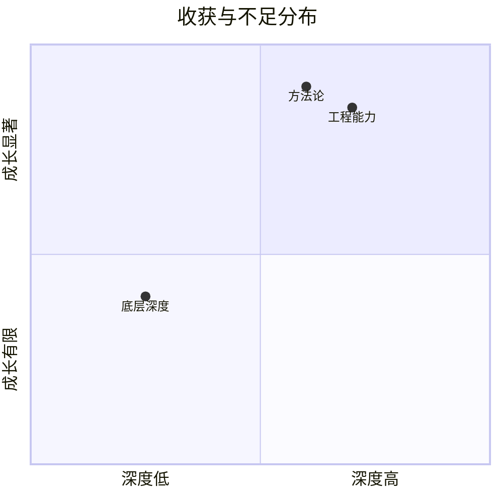

两个月实习在工程能力与方法论上显著成长。方法论沉淀包括 vanilla 对照组二分法做 bug 归因、只读旁路可观察性做 trace、纯净原则审计清单做文档质量保障。认知升级：工具是行为约束不只声明能力，隐式交互脆弱需显式强约束，看起来完整不等于真的能用。不足在底层深度不够，对 OmniOperator 最底层向量化内核与编译器实现了解不够清楚；skill 包最大缺口是零实战验证，是最佳实践陈述而非工作流提炼；8 月切入 Agent 项目后 OmniStream 深度推进受限，时间分配需优化。

### Notes:

两个月实习在工程能力与方法论上显著成长。方法论沉淀包括vanilla对照组二分法做bug归因、只读旁路可观察性做trace、纯净原则审计清单做文档质量保障。认知升级：工具是行为约束不只声明能力，隐式交互脆弱需显式强约束，看起来完整不等于真的能用。不足在底层深度不够，对OmniOperator最底层向量化内核与编译器实现了解不够清楚。skill包最大缺口是零实战验证。8月切入Agent项目后OmniStream深度推进受限，时间分配需优化。

---

下一步学习计划

- 1、OmniStream 开发继续推进：补齐剩余表达式类型，推进性能验证与开源贡献
- 2、底层深度补齐：深入向量化内核与编译器实现，从能用走向吃透
- 3、Agent 工程化实战：推进 skill 包真实场景跑通，深化公式原生插入能力扩展

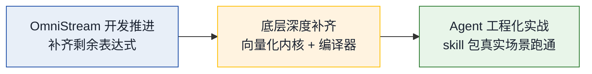

围绕三个方向继续提升。OmniStream 开发继续推进补齐剩余表达式类型，推进性能验证与开源贡献；底层深度补齐深入向量化内核与编译器实现，从能用走向吃透；Agent 工程化实战推进 skill 包真实场景跑通，深化公式原生插入的矩阵方程组重音支持扩展。

### Notes:

围绕三个方向继续提升。OmniStream开发继续推进补齐剩余表达式类型，推进性能验证与开源贡献。底层深度补齐深入向量化内核与编译器实现，从能用走向吃透。Agent工程化实战推进skill包真实场景跑通，深化公式原生插入的矩阵方程组重音支持扩展。

---

# 致   谢

感谢在座的评委、各位领导百忙中抽出时间参与本次答辩！

感谢导师向云武、主管李兆星、周围的同事的指导与帮助！

感谢所有给予过帮助指导和工作支持的人们！

### Notes:
