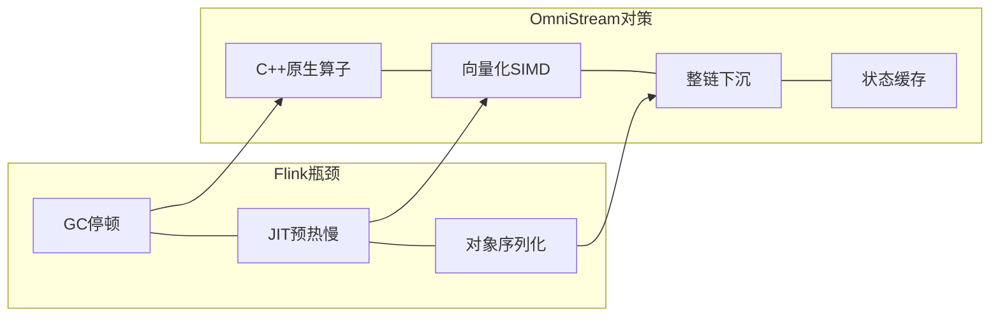
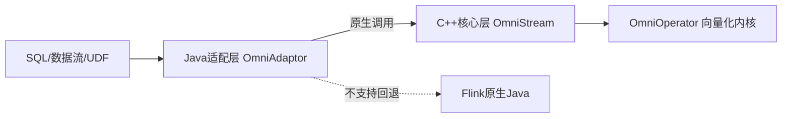
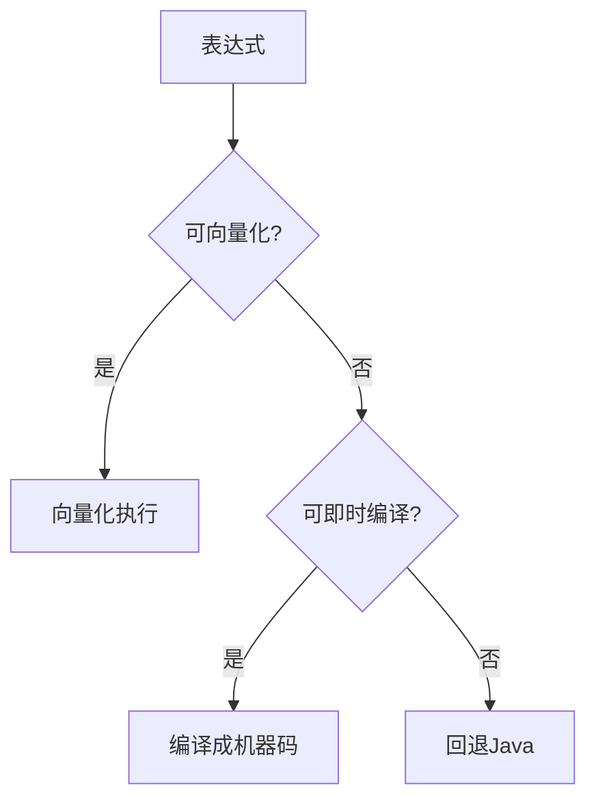
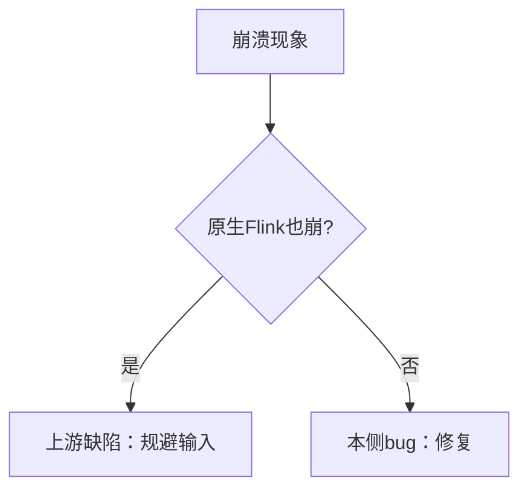
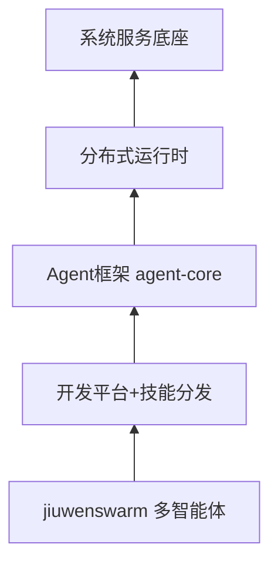
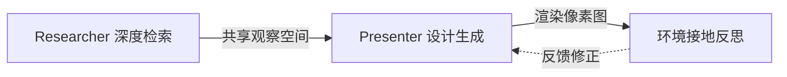
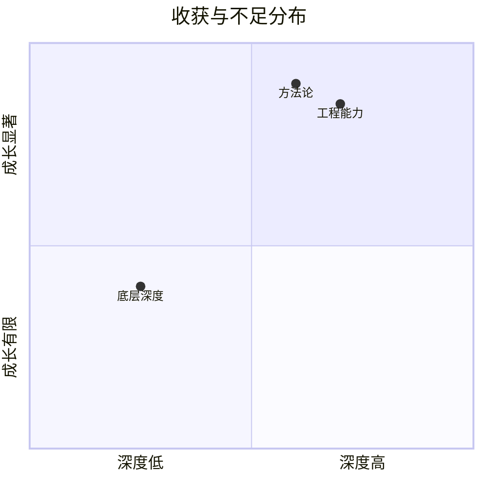
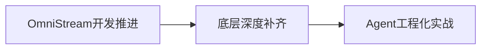

# 实习生答辩

员工：田沛康                                           部门：SAIE业务域
导师：向云武		      	       直接主管：李兆星
Security Level:

### Notes:

---

# 目录

1
自我介绍

2

学习及工作内容

3

主要工作输出及总结

4

自我反思及下一步学习计划

### Notes:

本次答辩分四部分递进汇报。

---

# 自我介绍

教育经历
2023.09 - 2027.06
华南理工大学  计算机科学与技术

工作经历
2026.07 - 至今
华为  Omni生态 大数据方向

入职华为
2026.07.01
SAIE业务域（ICT BG) AI应用工程师

### Notes:

本次答辩汇报两个月实习工作。实习聚焦华为Omni生态两个项目：7月上中旬OmniStream表达式开发，7月下旬至8月AgentOS的PPT-Agentskill开发。从大数据基础学习切入，逐步深入到Native算子开发与Agent工程化。

---

# 目录

1
自我介绍

2

学习及工作内容

3

主要工作输出及总结

4

自我反思及下一步学习计划

### Notes:

第二部分：学习及工作内容介绍。

---

学习及工作内容介绍

| 分类     | 工作学习任务                                                                                                                             | 输出和收获                                                                                                       |
| -------- | ---------------------------------------------------------------------------------------------------------------------------------------- | ------------------------------------------------------------------------------------------------------------------ |
| 个人相关 | 1、大数据基础学习（Flink/Spark/鲲鹏920 ARM生态） 2、电商日志全流程（Flume→Kafka→Spark→Hive） 3、Agent生态调研（九问平台、27方案） 4、开发工具链建设（6+构建+审计skill） | 建立流处理全貌认知 走通编译部署全流程 形成完整编译地图 理清skill→workflow执行链路 固化构建→测试→审计一条命令化 |
| 工作相关 | 1、OmniStream 8类SQL表达式原生化（ISNULL/LEFT-RIGHT/BETWEEN/NOT IN/EXISTS/SIMILAR TO等） 2、bug修复（BetweenExpr崩溃/注册名错位/静默回退） 3、PPT-Agentskill开发与调优（4角色流水线/.trace/公式原生插入/大重构PR#7#8） | 10+表达式提PR 走通设计→审计→修复全链路 确立vanilla对照组二分法 4角色流水线落地 26公式WPS验证通过 27文件纯净审计15必修 21篇Wiki约34万字 |

Page

### Notes:

学习与工作交织推进。个人相关打基础：大数据基础学习建立流处理全貌认知，Agent生态调研理清skill驱动机制，开发工具链固化一条命令化。工作相关出产出：OmniStream 8类表达式原生化10+提PR，bug修复确立vanilla二分法，PPT-Agentskill 4角色流水线落地加26公式WPS验证，调优完成HITL显式化与大重构PR#7#8及27文件纯净审计15必修。21篇Wiki约34万字沉淀全程。

---

# 目录

1
自我介绍

2

学习及工作内容

3

主要工作输出及总结

4

自我反思及下一步学习计划

### Notes:

第三部分：主要工作输出及总结。

---

项目背景： OmniStream--基于Flink生态的流处理性能加速项目

- **JVM 三瓶颈**：GC 停顿打断低延迟 / 字节码预热慢、热点才编译 / 对象序列化开销逐条放大
- **OmniStream 对策**：用 C++ 重写算子，配合向量化 SIMD 指令
- **端到端效果**：消除 JVM 开销，提升流处理性能

### Notes:

OmniStream是openEuler社区、华为鲲鹏BoostKit大数据OmniRuntime生态中面向Apache Flink的流计算Native化加速项目。核心思路是用C/C++重写Flink的SQL与DataStream算子，配合鲲鹏AArch64的SIMD向量化指令，在不改Flink一行代码的前提下端到端提升性能。Flink跑在JVM上，高负载下有三类瓶颈：GC停顿打断低延迟、字节码先解释执行预热慢、对象序列化开销大。共同根源是"JVM托管执行+行式对象模型"。OmniStream四招对症下药：C++写算子消除JVM开销、SIMD向量化批量算、整条算子链下沉Native减少JNI往返、状态缓存降低RocksDB磁盘IO。项目适配Flink 1.16.3，当前版本1.3.0。

---

三仓库双层架构：Java适配层 + C++核心层

| 仓库 | 职责 | 产物 |
| ---- | ---- | ---- |
| OmniStream | 原生运行时框架 | libtnel.so |
| OmniAdaptor | Flink桥接与算子替换决策 | flink-tnel.jar |
| OmniOperator | 底层向量化算子内核 | 5×.so + 2×.jar |

- **Java 适配层**：拦执行计划 / 判断 Native 化 / JNI 初始化 / 不支持回退
- **C++ 核心层**：算子、状态、数据流、连接器全在 C++ 闭环
- **零侵入接入**：只改两个配置文件，不改 Flink 内核代码

### Notes:

项目分三个仓库协作。Java适配层对接Flink，负责拦执行计划、判断能不能Native化、JNI初始化、不支持就回退。C++核心层执行算子，包含完整的运行时框架。端到端链路：SQL → 适配层注入原生描述并决策替换 → 原生任务接管 → 调用核心层算子链 → 向量化内核执行 → 结果回流Flink。零侵入接入是关键设计：只改两个配置文件，不改Flink内核代码。不支持的算子自动回退Flink原生Java执行，保证完全兼容。

---

表达式开发总览：让SQL表达式走Native加速路径

- **5 阶段生命周期**：规划 → 部署 → 解析 → 编译 → 运行
- **四类分类体系**：Type A 标量函数 / Type B 特殊语法 / Type C 聚合 / Type D 别名
- **双执行后端**：向量化优先，即时编译次选，都不行回退 Java
- **选路公式**：优先向量化，不行才即时编译，都不行回退 Java

### Notes:

表达式开发就是让Flink SQL中的表达式走OmniStream Native向量化执行路径，替代Flink原生Java执行。一条表达式从SQL到Native执行经历五阶段：规划期识别表达式翻译JSON、部署期嵌入算子链、解析期转表达式树、编译期验证并编译、运行期批量向量化执行。按表达式特点分四类：Type A标量函数、Type B特殊语法、Type C聚合函数、Type D SQL别名。每类有对应开发范式。执行路径两条：向量化（预写列函数覆盖广）与即时编译（编译成机器码表达式融合）。优先向量化，不行才即时编译，都不行回退Java。

---

表达式开发案例：三类范式覆盖

| 案例 | 范式 | 要点 |
| ---- | ---- | ---- |
| IFNULL | 别名映射 | 一行代码完成原生化 |
| LEFT/RIGHT | 纯向量化 | Unicode安全，码点不截断 |
| BETWEEN | 借原语编译 | 语义可拆，组合执行 |

- **IFNULL**：语义等价已有函数，一行映射完成原生化
- **LEFT/RIGHT**：按 UTF-8 码点切片，绝不切断多字节字符
- **BETWEEN**：语义可拆成两个比较，借已有原语组合执行
- **SIMILAR TO**：正则不可拆，需专用函数解释执行

### Notes:

三个案例覆盖不同开发范式。IFNULL语义等价两参COALESCE，在适配层加一行映射，整链按COALESCE走，内核零改动。一行代码完成一个表达式的原生化。LEFT和RIGHT是镜像的真正native字符串函数，按UTF-8码点步进切片，绝不切断多字节字符。空值由框架自动传播。BETWEEN的语义能拆成两个不大于判断，借已有向量化原语组合执行，不需要新写函数。SIMILAR TO是正则不可拆，需专用函数解释执行。

---

问题排查：BETWEEN崩溃定位与vanilla对照组二分法

- **问题**：BETWEEN 在反向区间下崩溃
- **方法**：用原生 Flink 做对照组二分法
- **投影路径**：原生也崩 = Flink 源码缺陷，规避输入
- **过滤路径**：原生正常 = 本侧 bug，修复
- **价值**：让"甩锅还是背锅"有客观依据
- **工程收益**：沉淀注册名大小写、静默回退、类型错位等问题

### Notes:

开发BETWEEN时发现崩溃，但不确定是Flink/Calcite上游缺陷还是本侧native实现bug。用vanilla也就是原生Flink做对照组：把同一用例同时跑在原生Flink与Omni原生实现上对比。原生也崩说明是Flink 1.16.3源码缺陷，与Omni无关，测试主动规避这类输入。原生正常而Omni崩说明是本侧bug，修复。这让"甩锅还是背锅"有了客观依据。过程中还解决了注册名大小写敏感、静默回退、类型错位等多个工程问题，均沉淀进开发工具与文档。

---

项目背景： AgentOS--一体机办公Agent与PPT-Agentskill

- **定位**：基于九问 Agent 平台开发一体机办公 Agent
- **目标**：把大模型能力做成本地化、可编辑交付的办公智能体
- **可编辑刚需**：产物必须可编辑（中文办公刚需）
- **降本**：本地化部署，接一体机模型降本
- **硬约束**：WPS 兼容性催生公式原生插入核心难题

### Notes:

AgentOS即openJiuwen九问Agent平台，提供Agent全生命周期开发与运行能力，自底向上五层：系统服务底座→分布式运行时→Agent框架→开发平台与技能分发→开箱即用智能体。一体机办公Agent把大模型能力做成本地化、可编辑交付的办公智能体。产物必须可编辑是中文办公刚需，走原生PPT路线而非图片型导出。本地化部署接一体机模型降本。

---

4角色流水线架构：attachment-reader → planner → researcher → designer

- **4 角色各司其职**，强制分工与校验
- **attachment-reader**：MinerU-first 提取结构化内容
- **ppt-planner**：设计大纲结构 + 需求对齐
- **ppt-researcher**：调研信息 + 写文稿 + 自审
- **ppt-designer**：视觉平衡 HTML 幻灯片 + 逐页 QA
- **产物链路**：attachments → outline.json → manuscript.md → slides/ → .pptx
- **双层质量保证**：脚本硬校验 + LLM 自审
- **只读约束**：每阶段不得修改上游产物，只增强/标注

### Notes:

PPT-Agentskill是九问平台上的4角色专门化流水线。单一失败模式是单agent PPT生成产出浅、未校验、视觉不一致——一个agent无法同时精通文档提取、结构规划、深度研究与视觉设计。Pipeline强制专门化、校验、用户确认检查点。四个角色：附件提取→大纲规划→文稿研究→视觉设计。每阶段产物有固定路径与脚本校验，且不得修改上游产物。双层质量保证：脚本硬校验管结构，LLM自审管语义。还设计了.trace/可观察性体系：每个阶段每个agent调用都在工作区按阶段编号落盘完整返回，只读旁路不改变控制流。

---

PPTv2agent参考：DeepPresenter双Agent架构与Content Style

- **DeepPresenter**：ACL2026 SOTA（均分 4.44 超 Gamma 4.36）
- **双 Agent 架构**：共享观察空间 + 环境接地反思
- **看齐内容风格五条**：
- 信息加工成半成品而非原材料
- 每页围绕一个核心洞察
- 金字塔原则，主题句领起
- 图片承载信息而非填空
- 优先可信来源（arxiv/wikipedia/官方）
- **定位**：学术参考方法论，PPT-Agentskill 是工程落地

### Notes:

PPTv2agent即PPTAgent v2又称DeepPresenter，是当前学术SOTA，评测均分4.44超越商业系统Gamma的4.36。架构为Researcher加Presenter双agent共享观察空间，加环境接地反思——渲染成像素图反馈修正。看齐其信息美学内容风格五条：信息加工成半成品而非原材料、每页围绕一个核心洞察、金字塔原则主题句领起、图片承载信息而非填空、优先可信来源。它是学术参考方法论，PPT-Agentskill是在九问平台上落地的工程实现。设计器引擎源自其提取重写为独立CLI。

---

skill框架比较：ppt-pipeline-swarm vs 标准swarm-skill vs PPTv2agent

| 维度 | 标准swarm-skill | ppt-pipeline-swarm |
| ---- | --------------- | ----------------- |
| 编排 | 工具跑原语 | 手动建队编排 |
| 质量门 | 脚本内嵌 | 脚本+LLM双层 |
| 人机交互 | 原语 | 转达协议 |

- **相比标准形态**：简化为手动编排，适合固定流水线
- **相比 PPTv2agent**：平台上的工程实现，非学术方法
- **设计器引擎**：源自 PPTAgent v2 提取重写为独立 CLI
- **选型依据**：固定流水线 + 断点续跑 → 编排式；一人用 + 流程灵活 → 单 agent

### Notes:

本skill相比标准多角色skill简化为手动编排，更适合固定流水线与断点续跑。人机交互用转达协议——标记前缀让队长识别必须转达，替代原语。相比PPTAgent v2学术方法是双Agent反思，本skill是平台上的工程实现，4角色分工加脚本校验。设计器引擎源自PPTAgent v2提取重写为独立CLI。选型依据：固定流水线加断点续跑走编排式，一人用加流程灵活走单agent自包含。

---

项目背景： 公式原生插入--可编辑OMML方程而非图片

- **需求**：公式必须可编辑，WPS 兼容
- **根因 1**：Python PPT 库不支持原生公式（2019 年至今未解决）
- **根因 2**：PowerPoint 需特殊命名空间包装
- **根因 3**：WPS 渲染有多个兼容陷阱（不渲染直立体、不认某些包装）
- **方案四次迭代**：图片 → 转换库 → 重型工具 → 手写解析器

### Notes:

把公式做成可编辑的原生方程而非图片，是本项目的核心难题。中文办公场景公式必须可编辑非图片截图，且WPS兼容是硬约束。三大根因：Python PPT库不支持原生公式自2019年至今未解决、PowerPoint需特殊命名空间包装、WPS渲染有多个兼容陷阱。方案经历四次迭代：转图片全兼容但不可编辑、转换库生成WPS不渲染、重型工具太重、最终手写递归下降解析器直接生成原生公式，WPS已验证可见。

---

产出：公式原生插入方案与验证

- **手写解析器**：递归下降解析器直接生成 OMML
- **全链路**：文稿 → 设计器标记 → 收集 → 注入原生方程
- **验证结果**：26 个公式全部成功，WPS 可见
- **零新增依赖**：复用已有库
- **文件更小**：32KB vs 图片 96KB
- **配套产出**：公式识别规范决策表与校验脚本

### Notes:

最终方案手写递归下降解析器直接生成原生公式XML，全链路打通且零新增依赖。链路：文稿写公式按识别规范判定→设计器标记→收集→后处理注入原生方程。验证结果：8种公式类型加26个文稿公式全部注入成功，WPS可见性确认，文件32KB远小于图片方案的96KB。配套公式识别规范决策表与校验脚本，从源头保证可正确注入。不支持命令降级为友好文本如分数变成括号形式。

---

Wiki产出：工作指南、知识拓展、基础学习、工程实践21篇

- **基础学习 5 篇**：PPTAgent 框架解析、九问 skill 机制、swarmflow 原语
- **知识拓展 6 篇**：4 种组装方式选型、公式插入 8 项目对比、样式模板调研
- **工作指南 2 篇**：PresentBench 30 条检查项、三 agent 产物设计原则
- **工程实践 8 篇**：4 分支审计 + 纯净性总结，50+ commit 可追溯
- **核心数据**：21 篇约 34 万字，5 个开源项目横向调研
- **验证产出**：26 公式端到端验证，12 套 CSS 模板确定性物化

### Notes:

除了项目上设计文档和直接代码产出，两个月还沉淀了21篇Wiki文稿约34万字，分四类。基础学习5篇解读开源框架平台的内部机制，为项目设计提供底层认知。知识拓展6篇横向调研参考项目，为技术选型提供对比依据。工作指南2篇从评测标准反推生成策略。工程实践8篇记录每次改动的根因、原则、验证，每条改动可追溯到提交。核心数据：8个分支审计50多个提交可追溯，5个开源项目横向调研，公式方案26公式端到端验证。

---

# 目录

1
自我介绍

2

学习及工作内容

3

主要工作输出及总结

4

自我反思及下一步学习计划

### Notes:

第四部分：自我反思及下一步学习计划。

---

# 收获和体会/有待改进之处

- **收获**：代码开发能力提高、培养工程化思维
- **收获**：熟悉 OmniStream 表达式开发与 Agent 工程化
- **收获**：方法论沉淀（vanilla 二分法、只读旁路可观察性、纯净原则审计）
- **不足**：底层向量化内核与编译器实现了解不够清楚
- **不足**：skill 包零实战验证，是最佳实践陈述非工作流提炼
- **不足**：8 月切入 Agent 项目后 OmniStream 深度推进受限

### Notes:

两个月实习在工程能力与方法论上显著成长。方法论沉淀包括vanilla对照组二分法做bug归因、只读旁路可观察性做trace、纯净原则审计清单做文档质量保障。认知升级：工具是行为约束不只声明能力，隐式交互脆弱需显式强约束，看起来完整不等于真的能用。不足在底层深度不够，对OmniOperator最底层向量化内核与编译器实现了解不够清楚。skill包最大缺口是零实战验证。8月切入Agent项目后OmniStream深度推进受限，时间分配需优化。

---

下一步学习计划

- **1、OmniStream 开发继续推进**：补齐剩余表达式类型，推进性能验证与开源贡献
- **2、底层深度补齐**：深入向量化内核与编译器实现，从能用走向吃透
- **3、Agent 工程化实战**：推进 skill 包真实场景跑通，深化公式原生插入能力扩展

### Notes:

围绕三个方向继续提升。OmniStream开发继续推进补齐剩余表达式类型，推进性能验证与开源贡献。底层深度补齐深入向量化内核与编译器实现，从能用走向吃透。Agent工程化实战推进skill包真实场景跑通，深化公式原生插入的矩阵方程组重音支持扩展。

---

# 致   谢

感谢在座的评委、各位领导百忙中抽出时间参与本次答辩！

感谢导师向云武、主管李兆星、周围的同事的指导与帮助！

感谢所有给予过帮助指导和工作支持的人们！

### Notes:
