# 实习生答辩

员工：田沛康                                           部门：SAIE业务域
导师：向云武		      	       直接主管：李兆星
Security Level:

### Notes:

---

# 目录

1
自我介绍

2

学习及工作内容

3

主要工作输出及总结

4

自我反思及下一步学习计划

### Notes:

本次答辩分四部分递进汇报。

---

# 自我介绍

教育经历
2023.09 - 2027.06
华南理工大学  计算机科学与技术

工作经历
2026.07 - 至今
华为  Omni生态 大数据方向

入职华为
2026.07.01
SAIE业务域（ICT BG) AI应用工程师

### Notes:

本次答辩汇报两个月实习工作。实习聚焦华为Omni生态两个项目：7月上中旬OmniStream表达式开发，7月下旬至8月AgentOS的PPT-Agentskill开发。从大数据基础学习切入，逐步深入到Native算子开发与Agent工程化。

---

# 目录

1
自我介绍

2

学习及工作内容

3

主要工作输出及总结

4

自我反思及下一步学习计划

### Notes:

第二部分：学习及工作内容介绍。

---

学习及工作内容介绍

| 分类     | 工作学习任务                                                                                                                                                                                                           | 输出和收获                                                                                                                               |
| -------- | ---------------------------------------------------------------------------------------------------------------------------------------------------------------------------------------------------------------------- | ---------------------------------------------------------------------------------------------------------------------------------------- |
| 个人相关 | 1、大数据基础学习（Flink/Spark/鲲鹏920 ARM生态） 2、电商日志全流程（Flume→Kafka→Spark→Hive） 3、Agent生态调研（九问平台、27方案） 4、开发工具链建设（6+构建+审计skill）                                             | 建立流处理全貌认知 走通编译部署全流程 形成完整编译地图 理清skill→workflow执行链路 固化构建→测试→审计一条命令化                        |
| 工作相关 | 1、OmniStream 8类SQL表达式原生化（ISNULL/LEFT-RIGHT/BETWEEN/NOT IN/EXISTS/SIMILAR TO等） 2、bug修复（BetweenExpr崩溃/注册名错位/静默回退） 3、PPT-Agentskill开发与调优（4角色流水线/.trace/公式原生插入/大重构PR#7#8） | 10+表达式提PR 走通设计→审计→修复全链路 确立vanilla对照组二分法 4角色流水线落地 26公式WPS验证通过 27文件纯净审计15必修 21篇Wiki约34万字 |

Page

### Notes:

学习与工作交织推进。个人相关打基础：大数据基础学习建立流处理全貌认知，Agent生态调研理清skill驱动机制，开发工具链固化一条命令化。工作相关出产出：OmniStream 8类表达式原生化10+提PR，bug修复确立vanilla二分法，PPT-Agentskill 4角色流水线落地加26公式WPS验证，调优完成HITL显式化与大重构PR#7#8及27文件纯净审计15必修。21篇Wiki约34万字沉淀全程。

---

# 目录

1
自我介绍

2

学习及工作内容

3

主要工作输出及总结

4

自我反思及下一步学习计划

### Notes:

第三部分：主要工作输出及总结。

---

项目背景： OmniStream--基于Flink生态的流处理性能加速项目

- GC 停顿打断低延迟
- JIT 预热慢，热点才编译
- 序列化逐条放大

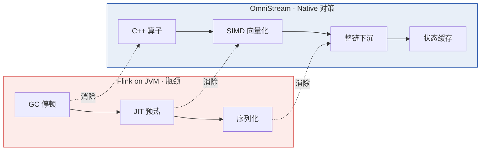

OmniStream 用 C/C++ 重写 Flink 算子，配合 AArch64 向量化指令，在不改 Flink 一行代码的前提下端到端提升性能。

### Notes:

OmniStream是openEuler社区、华为鲲鹏BoostKit大数据OmniRuntime生态中面向Apache Flink的流计算Native化加速项目。核心思路是用C/C++重写Flink的SQL与DataStream算子，配合鲲鹏AArch64的SIMD向量化指令，在不改Flink一行代码的前提下端到端提升性能。Flink跑在JVM上，高负载下有三类瓶颈：GC停顿打断低延迟、字节码先解释执行预热慢、对象序列化开销大。共同根源是"JVM托管执行+行式对象模型"。OmniStream四招对症下药：C++写算子消除JVM开销、SIMD向量化批量算、整条算子链下沉Native减少JNI往返、状态缓存降低RocksDB磁盘IO。项目适配Flink 1.16.3，当前版本1.3.0。

---

三仓库双层架构：Java适配层 + C++核心层

- Java 适配层：拦执行计划，判 Native 化，JNI 初始化
- C++ 核心层：算子/状态/数据流全在 C++ 闭环
- 零侵入接入：只改两个配置文件，不改 Flink 内核

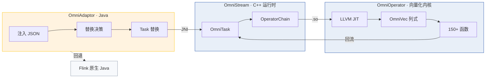

SQL → OmniAdaptor 注入 JSON 并决策替换 → OmniTask 经 JNI 调 libtnel.so → Mailbox 驱动算子链 → OmniOperator 向量化执行 → 结果回流 Flink。

### Notes:

项目分三个仓库协作。Java适配层对接Flink，负责拦执行计划、判断能不能Native化、JNI初始化、不支持就回退。C++核心层执行算子，包含完整的运行时框架。端到端链路：SQL → 适配层注入原生描述并决策替换 → 原生任务接管 → 调用核心层算子链 → 向量化内核执行 → 结果回流Flink。零侵入接入是关键设计：只改两个配置文件，不改Flink内核代码。不支持的算子自动回退Flink原生Java执行，保证完全兼容。

---

表达式开发：SQL表达式走Native加速路径

- 5 阶段：规划 → 部署 → 解析 → 编译 → 运行
- 代码位置：functions/*.{h,cpp} 造函数，codegen/*.cpp 接 JIT，jsonparser 建 Expr 节点

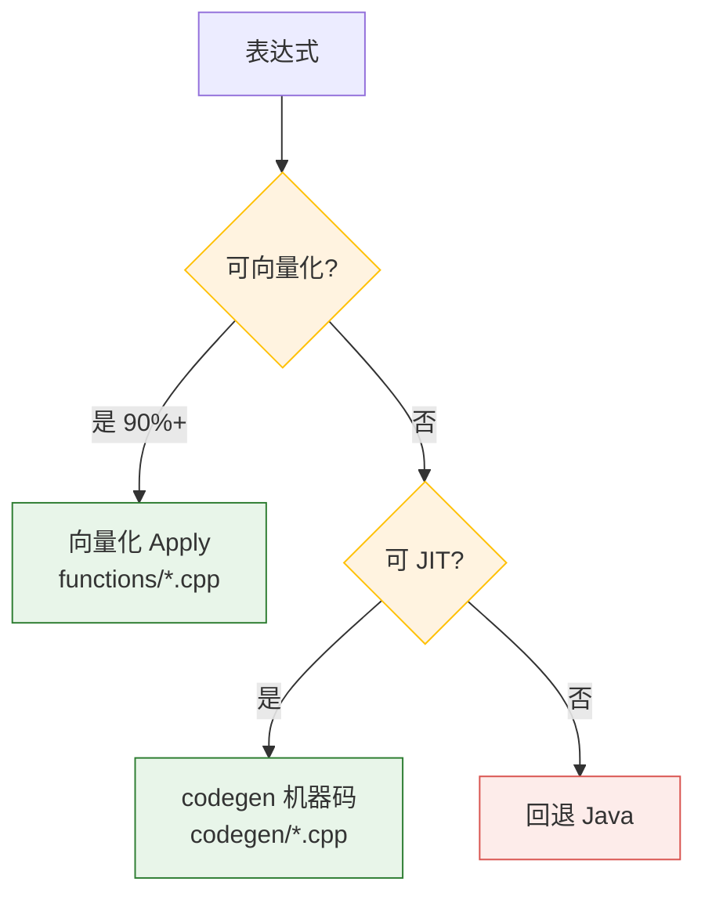

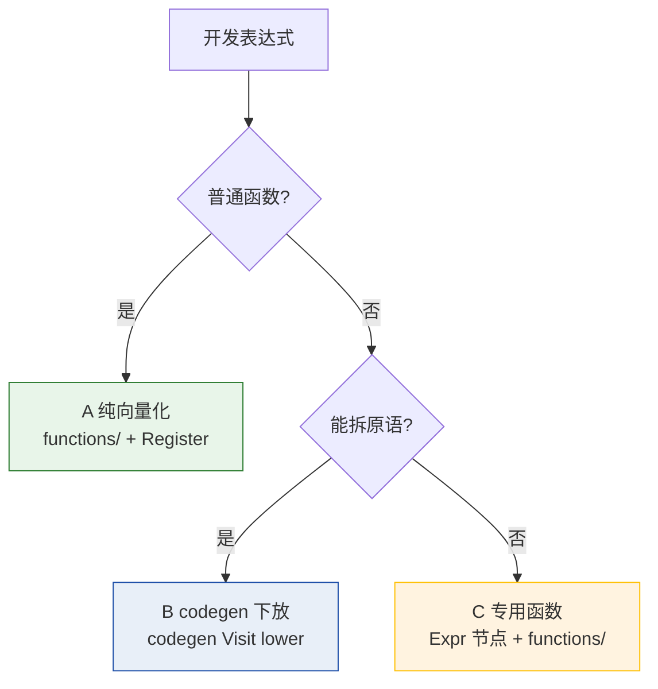

四类代码位置：① functions/*.{h,cpp} + Register 造可复用向量化函数；② expressions.{h,cpp} + jsonparser 建 Expr AST 节点；③ codegen/functions/*.cpp 逐行 JIT 函数；④ batch_expression_codegen.cpp 为 Expr 节点写 LLVM Visit。三范式：A 只造函数，B 建 Expr + codegen lower，C 建 Expr + 造函数。三仓库统一分支 2026_930_poc，每表达式独立分支开发后提 PR。

### Notes:

表达式开发让Flink SQL表达式走OmniStream Native向量化执行路径，替代Flink原生Java执行。一条表达式从SQL到Native经历五阶段：规划期识别翻译JSON、部署期嵌入算子链、解析期转表达式树、编译期验证并编译、运行期批量向量化。按特性分四类：A标量、B特殊语法、C聚合、D别名。执行两路径：向量化预写列函数覆盖广，codegen是LLVM JIT编译成机器码支持融合。优先向量化，不行才即时编译，都不行回退Java。三范式：IFNULL别名映射COALESCE一行完成，LEFT/RIGHT按UTF-8码点切片NULL自动传播，BETWEEN借lessThanEqual原语组合，SIMILAR TO正则不可拆造专用函数。

---

表达式开发产出：7个表达式落地

- 7 个表达式全部提 PR，走通设计→实现→审计→修复全链路
- 覆盖四类范式，验证 native == vanilla 归一化逐行一致
- 沉淀 vanilla 对照组二分法做 bug 归因

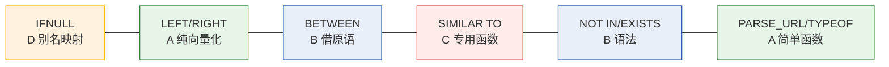

7 个表达式覆盖全部四类开发范式，每个独立分支开发后提 PR，全程经 vanilla 对照组二分法验证。

### Notes:

7个表达式覆盖全部四类开发范式：IFNULL别名映射COALESCE一行完成，LEFT/RIGHT按UTF-8码点切片，BETWEEN借lessThanEqual原语组合，SIMILAR TO正则不可拆造专用函数，NOT IN/EXISTS走算子级路径，PARSE_URL/TYPEOF简单函数向量化。每个表达式独立分支开发后提PR，全程经vanilla对照组二分法验证native==vanilla归一化逐行一致，过程中解决注册名大小写、静默回退、类型错位等工程问题。

---

项目背景： AgentOS--一体机办公Agent与PPT-Agentskill

- 定位：基于九问 Agent 平台开发一体机办公 Agent
- 目标：把大模型能力做成本地化、可编辑交付的办公智能体
- 硬约束：WPS 兼容性催生公式原生插入核心难题

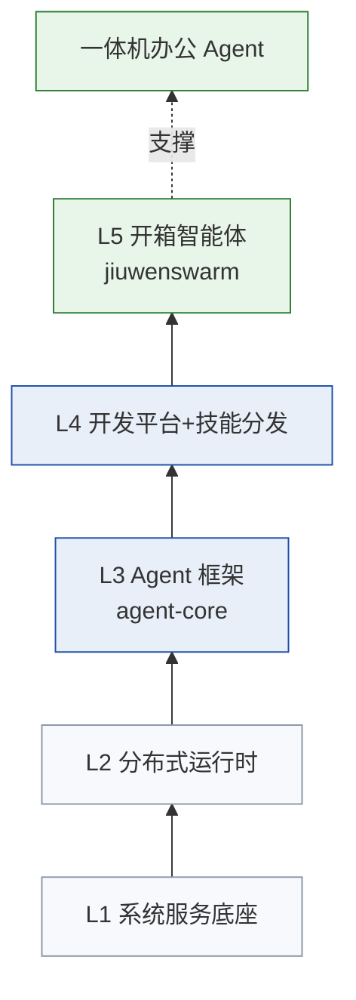

AgentOS 即九问 Agent 平台，提供 Agent 全生命周期能力，自底向上五层，一体机办公 Agent 把大模型能力做成本地化可编辑交付的智能体。

### Notes:

AgentOS即openJiuwen九问Agent平台，提供Agent全生命周期开发与运行能力，自底向上五层：系统服务底座→分布式运行时→Agent框架→开发平台与技能分发→开箱即用智能体。一体机办公Agent把大模型能力做成本地化、可编辑交付的办公智能体。产物必须可编辑是中文办公刚需，走原生PPT路线而非图片型导出。本地化部署接一体机模型降本。

---

4角色流水线架构：attachment-reader → planner → researcher → designer

- 4 角色各司其职，强制分工与校验
- 双层质量保证：脚本硬校验（结构）+ LLM 自审（语义）
- 只读约束：每阶段不得修改上游产物，只增强/标注

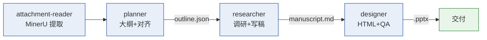

PPT-Agentskill 是九问平台上的 4 角色专门化流水线，强制分工、校验、用户确认检查点，双层质量保证（脚本硬校验 + LLM 自审）。

### Notes:

PPT-Agentskill是九问平台上的4角色专门化流水线。单一失败模式是单agent PPT生成产出浅、未校验、视觉不一致——一个agent无法同时精通文档提取、结构规划、深度研究与视觉设计。Pipeline强制专门化、校验、用户确认检查点。四个角色：附件提取→大纲规划→文稿研究→视觉设计。每阶段产物有固定路径与脚本校验，且不得修改上游产物。双层质量保证：脚本硬校验管结构，LLM自审管语义。还设计了.trace/可观察性体系：每个阶段每个agent调用都在工作区按阶段编号落盘完整返回，只读旁路不改变控制流。

---

PPTv2agent参考与skill框架比较

- DeepPresenter（PPTAgent v2）：ACL2026 SOTA，均分 4.44 超 Gamma 4.36
- 双 Agent 架构：Researcher 检索 + Presenter 生成 + 渲染反思
- 本 skill：平台工程落地，4 角色流水线 + 脚本校验

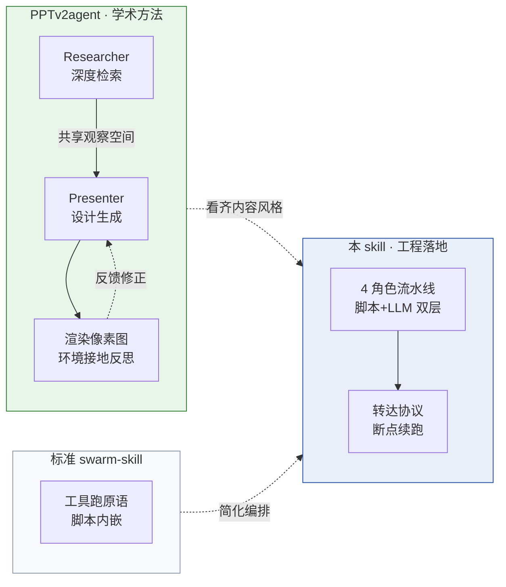

设计器引擎源自 PPTAgent v2 提取重写为独立 CLI，去掉了 v2 的 MCP/agent environment 依赖，适配 swarm-skill 调用模式。

### Notes:

PPTv2agent 即 PPTAgent v2（EMNLP 2025），又称 DeepPresenter（ACL 2026），当前学术 SOTA，评测均分 4.44 超商业系统 Gamma 4.36。架构为 Researcher + Presenter 双 Agent 共享观察空间，加环境接地反思——每页生成后 inspect_slide 渲染成像素图供视觉反思修正。还提供推荐微调模型 DeepPresenter-9B。

看齐其内容风格五条（Content Style Guidelines）：① 追求信息美学，信息加工成半成品而非原材料，图作视觉焦点；② 每页围绕一个核心洞察，深度分析提炼高价值结论；③ 金字塔原则，主题句领起，仅首次术语和关键结论加粗；④ 图片即内容，基于页面高度抽象与核心隐喻，禁通用商务占位图；⑤ 优先可信来源（arxiv/wikipedia/官方/权威媒体）。

本 skill 相比标准 swarm-skill 简化为手动编排（建队→派角色→建任务依赖），更适合固定流水线与断点续跑，人机交互用转达协议（标记前缀让队长识别必须转达）替代原语。相比 PPTv2agent 学术方法是双 Agent 渲染反思，本 skill 是平台上的工程实现，4 角色分工加脚本校验（脚本硬校验管结构，LLM 自审管语义）。设计器引擎 html2pptx 源自 PPTAgent v2 提取重写为独立 CLI，去掉了 v2 的 MCP/agent environment 依赖。选型依据：固定流水线加断点续跑走编排式，一人用加流程灵活走单 Agent 自包含。

---

公式原生插入：可编辑OMML方程而非图片

- 需求：公式必须可编辑，WPS 兼容
- 方案：手写递归下降解析器生成 OMML，26 公式验证通过
- 优势：零新增依赖，文件 32KB 远小于图片 96KB

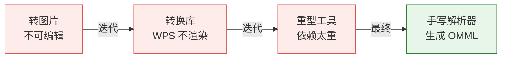

方案四次迭代最终手写递归下降解析器直接生成 OMML，全链路打通零新增依赖，26 公式注入成功 WPS 可见。

### Notes:

把公式做成可编辑原生方程而非图片是本项目核心难题。中文办公公式必须可编辑，WPS 兼容是硬约束。三大根因：Python PPT 库不支持原生公式（2019 至今未解决）、PowerPoint 需特殊命名空间包装、WPS 渲染有多个兼容陷阱。

方案四次迭代：转图片全兼容但不可编辑，转换库 WPS 不渲染，重型工具 150MB 太重，最终手写递归下降解析器直接生成 OMML。全链路：文稿写公式按识别规范判定 → 设计器 data-latex 标记 → html2pptx 收集到 sidecar JSON → build_deck 调 inject_omml 注入原生方程。

OMML 输出结构经 WPS 验证可见：段落 → a14:m 包装 → m:oMathPara → m:oMath → 各元素（m:f 分数 / m:rad 根号 / m:sSub 上下标 / m:m 矩阵 / m:acc 重音）。关键设计：颜色写 a:rPr 非 m:rPr，block 显式 m:jc 对齐，a14 命名空间手动注册，多字母词直立用源头纯文本。

验证：8 种类型加 26 个公式全部注入成功，WPS 可见，文件 32KB 远小于图片 96KB，零新增依赖仅 python-pptx + 标准库。配套识别规范决策表（9 类 + 决策树）与校验脚本，不支持命令降级为友好文本（如 \frac{a}{b} → (a)/(b)），不阻断交付。

---

Wiki产出：工作指南、知识拓展、基础学习、工程实践21篇

- 基础学习 5 篇：PPTAgent 框架解析、九问 skill 机制、swarmflow 原语
- 知识拓展 6 篇：4 种组装方式选型、公式插入 8 项目对比、样式模板调研
- 工程实践 8 篇：4 分支审计 + 纯净性总结，50+ commit 可追溯

两个月沉淀 21 篇 Wiki 约 34 万字，分四类，8 个分支 50+ commit 可追溯，5 个开源项目横向调研。

### Notes:

除了项目上设计文档和直接代码产出，两个月还沉淀了21篇Wiki文稿约34万字，分四类。基础学习5篇解读开源框架平台的内部机制，为项目设计提供底层认知。知识拓展6篇横向调研参考项目，为技术选型提供对比依据。工作指南2篇从评测标准反推生成策略。工程实践8篇记录每次改动的根因、原则、验证，每条改动可追溯到提交。核心数据：8个分支审计50多个提交可追溯，5个开源项目横向调研，公式方案26公式端到端验证。

---

# 目录

1
自我介绍

2

学习及工作内容

3

主要工作输出及总结

4

自我反思及下一步学习计划

### Notes:

第四部分：自我反思及下一步学习计划。

---

# 收获和体会/有待改进之处

收获：
代码开发能力提高，C++/Java 混合栈开发走通全链路
熟悉 OmniStream 流处理 Native 加速业务与编译构建流程
熟悉九问 Agent 平台生态与 PPT 流水线工程化
方法论沉淀：vanilla 二分法、只读旁路、纯净原则审计
认知升级：工具是行为约束，隐式交互脆弱，完整≠能用
不足：
工程编码能力不足，接触新问题时拆分解决能力需继续提升
底层原理理解不够，向量化内核与编译器实现待深入
多项目并行时时间管理与优先级调度能力不足，难以聚焦深入
skill 包零实战验证，最佳实践陈述非工作流提炼
下一步计划：
1、OmniStream 开发继续推进，补齐剩余表达式类型
2、底层深度补齐，深入向量化内核与编译器实现
3、Agent 工程化实战，推进 skill 包真实场景跑通

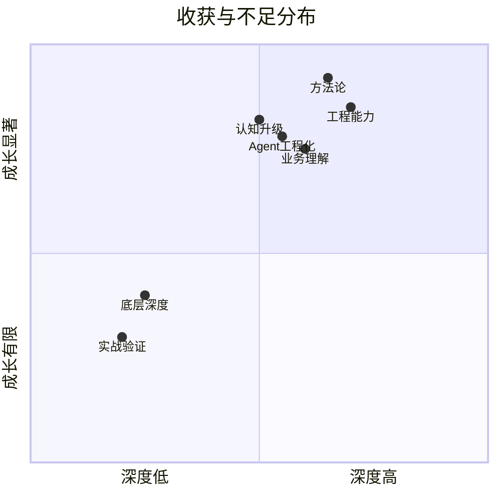

### Notes:

两个月实习在工程能力、业务理解与方法论上显著成长。工程能力：C++/Java 混合栈开发，OmniStream 10+ 表达式提 PR 走通设计→实现→审计→修复全链路，Agent 工程 4 角色流水线落地加公式原生插入。

业务理解：OmniStream 是面向 Flink 的 Native 化加速项目，解决 JVM 三瓶颈（GC/JIT/序列化），核心价值是零侵入接入不改 Flink 内核端到端提升流处理性能，适配金融风控、实时数仓等高吞吐低延迟场景。AgentOS 是九问平台上一体机办公 Agent，把大模型能力做成本地化可编辑交付的智能体，产物必须可编辑是中文办公刚需，WPS 兼容性催生公式原生插入核心难题。

方法论沉淀 15 条，核心几条：vanilla 对照组二分法做 bug 归因；只读旁路可观察性做 trace（落 workspace 不落 skill 目录）；纯净原则审计清单五类 16 项；声明式编排加动态生成代码；降级设计；允许 agent 犯错及时提示纠正。认知升级：工具是行为约束不只声明能力；隐式交互是脆弱的需显式强约束；思维链过长等于执行风险；看起来完整不等于真的能用；人工介入审计是质量闸门。

不足主要在个人能力提升方向：工程编码能力不足，接触新问题时拆分解决能力需继续提升；底层原理理解不够，向量化内核与编译器实现待深入，从能用走向吃透；多项目并行时时间管理与优先级调度能力不足，多线任务撕扯难以聚焦深入；skill 包零实战验证，是最佳实践陈述非工作流提炼。这些是后续工作中需刻意练习的方向。

---

下一步学习计划

- 1、OmniStream 开发继续推进：补齐剩余表达式类型，推进性能验证与开源贡献
- 2、底层深度补齐：深入向量化内核与编译器实现，从能用走向吃透
- 3、Agent 工程化实战：推进 skill 包真实场景跑通，深化公式原生插入能力扩展

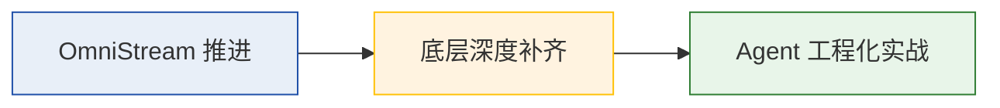

围绕三个方向继续提升：OmniStream 推进、底层深度补齐、Agent 工程化实战。

### Notes:

围绕三个方向继续提升。OmniStream开发继续推进补齐剩余表达式类型，推进性能验证与开源贡献。底层深度补齐深入向量化内核与编译器实现，从能用走向吃透。Agent工程化实战推进skill包真实场景跑通，深化公式原生插入的矩阵方程组重音支持扩展。

---

# 致   谢

感谢在座的评委、各位领导百忙中抽出时间参与本次答辩！

感谢导师向云武、主管李兆星、周围的同事的指导与帮助！

感谢所有给予过帮助指导和工作支持的人们！

### Notes:
