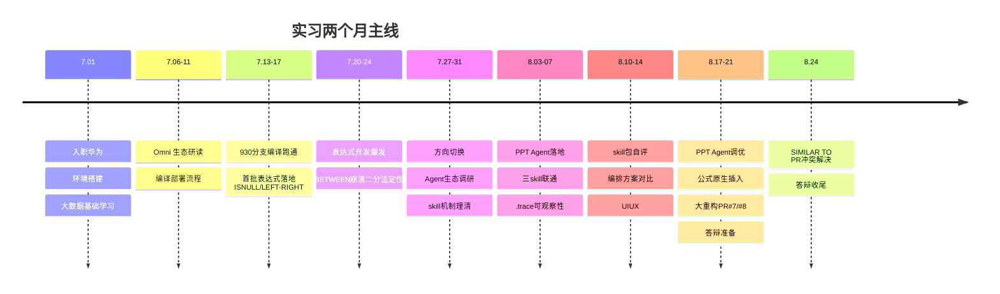

# 实习工作详述

> 本文档详尽记录 2026.07—2026.08 两个月实习期间完成的工作，按项目与主题组织，保留具体技术细节、问题与方案、量化数据，供留档与审计。
>
> 实习人：田沛康　部门：SAIE业务域　导师：向云武　直接主管：李兆星

---

## 目录

- [一、实习概述](#一实习概述)
- [二、OmniStream 项目](#二omnistream-项目)
  - [2.1 项目背景](#21-项目背景)
  - [2.2 三仓库双层架构](#22-三仓库双层架构)
  - [2.3 编译流程梳理](#23-编译流程梳理)
  - [2.4 表达式开发](#24-表达式开发)
  - [2.5 表达式开发案例](#25-表达式开发案例)
  - [2.6 问题排查与解决方案](#26-问题排查与解决方案)
  - [2.7 开发工具链建设](#27-开发工具链建设)
  - [2.8 知识库产出](#28-知识库产出)
- [三、AgentOS / PPT-Agentskill 项目](#三agentos--ppt-agentskill-项目)
  - [3.1 项目背景](#31-项目背景)
  - [3.2 九问平台调研](#32-九问平台调研)
  - [3.3 4 角色流水线架构](#33-4-角色流水线架构)
  - [3.4 研究员角色开发](#34-研究员角色开发)
  - [3.5 .trace/ 可观察性体系](#35-trace-可观察性体系)
  - [3.6 PPTv2agent 参考](#36-pptv2agent-参考)
  - [3.7 框架比较](#37-框架比较)
  - [3.8 公式原生插入](#38-公式原生插入)
  - [3.9 调优与大重构](#39-调优与大重构)
  - [3.10 纯净原则审计](#310-纯净原则审计)
- [四、Wiki 产出](#四wiki-产出)
- [五、方法论沉淀](#五方法论沉淀)
- [六、关键节点时间线](#六关键节点时间线)
- [七、每日工作纪要](#七每日工作纪要)

---

## 一、实习概述

### 1.1 基本信息

| 项 | 内容 |
|---|---|
| 实习单位 | 华为 |
| 入职日期 | 2026-07-01 |
| 部门 | SAIE业务域，Omni 生态（列式存储 / 大数据方向） |
| 实习周期 | 2026.07 — 2026.08 |
| 工作时间 | 08:30–18:00，净工时 8 小时 |
| 大模型环境 | 两套后端：智谱 MAAS（glm 系列）/ 华为 Ascend（deepseek-v4-pro） |

### 1.2 实习目标（五条）

1. 理解项目运作形式
2. 掌握大数据生态（SQL、Spark、Flink）
3. 提升 C++ 开发技能
4. 用 AI Agent 辅助研发实战
5. 参与开源贡献

### 1.3 两个项目定位

| 项目 | 周期 | 角色 | 核心工作 |
|---|---|---|---|
| OmniStream | 7月上中旬 | 表达式开发 | SQL 表达式原生加速、bug 修复、编译流程、工具链 |
| AgentOS / PPT-Agentskill | 7月下旬—8月 | 研究员部分开发与调优 | 4 角色流水线落地、可观察性、公式原生插入、大重构 |

### 1.4 主线时间线



---

## 二、OmniStream 项目

### 2.1 项目背景

**OmniStream 是什么**：openEuler 社区 + 华为鲲鹏 BoostKit 大数据 OmniRuntime 生态中面向 Apache Flink 的流计算 Native 化加速项目。核心思路是用 C/C++（Native Code）重写 Flink 的 SQL 与 DataStream 算子，配合 AArch64（鲲鹏）SIMD/SVE 向量化指令，在不改 Flink 一行代码的前提下端到端提升流处理性能。

- 仓库：`gitcode.com/openeuler/OmniStream`（三仓库：OmniStream / OmniAdaptor / OmniOperator）
- 适配 Flink 1.16.3
- 当前版本：OmniStream 1.3.0（2026.06.30 发布）

**解决什么问题**：Flink 跑在 JVM 上，高负载下有三类瓶颈，共同根源是"JVM 托管执行 + 行式对象模型"：

1. **GC 停顿** — JVM 堆上大量对象，GC 时 Stop-The-World 打断低延迟
2. **JIT 预热** — 字节码先解释执行（慢），攒够热点才编译成机器码
3. **对象序列化** — 数据流转/状态读写/快照时 Java 对象转字节流，逐条处理时被放大

OmniStream 四招对症下药：

| 核心价值 | 怎么做 | 解决的瓶颈 |
|---|---|---|
| 消除 JVM 开销 | C++ 写算子，状态/中间数据放堆外 Native 内存 | GC 停顿、JIT 预热 |
| 向量化计算 | SIMD 指令对列式数据批量算 | 单核算力不足 |
| 减少跨语言开销 | 整条算子链下沉 Native，JNI 从"每条记录一次"降到"每批一次" | 对象序列化、JNI 边界往返 |
| 状态访问优化 | OmniStateStore（Falcon 缓存）减少 RocksDB 磁盘 IO | 有状态计算的状态读写 |

### 2.2 三仓库双层架构

概念上"Java 适配层 + C++ 核心层"双层，物理上跨三个独立 git 仓库：

| 仓库 | 职责 | 技术栈 | 主要产物 |
|---|---|---|---|
| OmniStream | Native 运行时框架：Task / OperatorChain / Mailbox / State / Shuffle / SQL 与 DataStream 算子 | C++（CMake, aarch64+SVE, LLVM 15, GCC, PGO） | libtnel.so |
| OmniAdaptor | Flink 桥接：算子替换决策、Task 替换、Table Planner 注入 native JSON 描述 | Java（Maven, Flink 1.16.3）；omnihelper 为 Python 工具 | flink-tnel.jar、omni-table-planer.jar |
| OmniOperator | 底层向量化内核：算子、表达式、LLVM JIT codegen、OmniVec 列式格式、150+ 函数 | C++ + Java JNI binding | 5×.so + 2×.jar |

**端到端链路**：Flink SQL → OmniAdaptor 在 ExecNode 注入 native JSON 描述 + 决策算子替换 → OmniTask 替换 invokable class → JNI 调 OmniStream libtnel.so → C++ Mailbox 驱动算子链 → 算子内部经静态链接的 OmniOperator .so 调用向量化内核 → 结果经 native ResultPartition 回流 Flink 网络。

**零侵入接入**：只改 Flink 两个配置文件（config.sh 注入 flink-tnel JAR 到 CLASSPATH 前部；flink-conf.yaml 加 java.library.path），不改 Flink 内核代码。不支持的场景自动回退 Flink 原生 Java 执行，保证 100% 兼容。

**核心概念**：

- 双层架构：Java 适配层当"翻译官和守门员"（拦执行计划、判断能不能 Native 化、JNI 初始化、不支持就回退），C++ 核心层是"完整引擎"
- JNI 桥接层：25 个头文件 + 5 个 Bridge 实现类，双向通信（正向调入算子，反向回调 Checkpoint 物化）
- Mailbox 单线程模型：所有算子处理和 Checkpoint 在同一线程串行，免锁
- VectorBatch 列式向量化：继承自 OmniOperator，附加 timestamps/rowKinds
- OmniStateStore（Falcon 缓存）：状态缓存（LRU），降低 RocksDB 访问频次
- 算子级回退：不支持的算子不报错，退回 Flink 原生 Java Runtime
- Nexmark 基准测试：流处理性能基准套件

**版本演进**：

- 2025.06.30 v1.0.0：SQL 实现 Calc/GroupAgg/Join/Deduplicate/Rank/Window/Kafka 算子加速；OmniVec；内存和 RocksDB 状态后端。DataStream 实现 Map/FlatMap/Reduce/Filter/Kafka Source/Sink 加速；UDF 基础框架和翻译基础库
- 2025.12.30 v1.1.0：SQL 新增 task 级别算子回退机制；DataStream KeyedCoProcess 支持 checkpoint/restore
- 2026.03.30 v1.2.0：UDF 翻译工具头文件安装；OmniStateStore 加速特性
- 2026.06.30 v1.3.0：WindowAgg/WindowJoin 算子；Calc 算子支持 UDF 函数注册；Calc 支持 JSON_VALUE/JSON_QUERY/COALESCE/CHAR_LENGTH/TO_TIMESTAMP_LTZ 等内置函数（表达式开发与之相关）

### 2.3 编译流程梳理

**930 分支编译环境**搭建在 `/opt/buildtools` 下。完整编译流程：

1. `mkdir -p /opt/buildtools`
2. clone `OmniOperator_dependencies` 仓库，提取 `pkg_tmp` 目录
3. 从 notebook 仓库获取 `install_script` 目录
4. 分步安装：`install_base.sh` → `install_patch.sh` → JDK → BoostKit（ksl/kaccjson）→ LLVM → googletest → jemalloc → nlohmann_json → snappy → rocksdb → xxhash → rdkafka → boundscheck → abseil_re2
5. 按顺序构建：OmniOperator（vec）→ OmniAdaptor → OmniStream
6. **关键注意**：构建 OmniStream 前需关闭 OmniStateStore（`WITH_OMNISTATESTORE=OFF`）

**编译产物分布**：

- OmniAdaptor：`omniop-spark-extension/*`、`flink-tnel-0.1-SNAPSHOT.jar`
- OmniOperator：`/opt/buildtools/omni_home/omni-operator/lib/`（so 与 IR 文件）
- OmniStream：头文件、配置文件、动态库装到 `omni_home/omni-operator/` 下

**运行时依赖**：libtnel.so、OmniOperator 的 codegen/operator/vector 三个 so、libboundscheck.so、libLLVM-15.so，以及 xxhash、rdkafka、rocksdb、jemalloc、snappy、re2。

**编译监控技巧**：`pgrep -a make`（看 make 进程）、`top`（看 CPU 负载判断是否还在编译）。

### 2.4 表达式开发

#### 2.4.1 "表达式开发"具体指什么

让 Flink SQL 中的表达式（函数、操作符）走 OmniStream Native 向量化执行路径，替代 Flink 原生 Java 执行，实现性能加速。

一条表达式从 Flink SQL 到 Native C++ 执行的**5 阶段生命周期**：

```
阶段1 规划期 (Java, OmniAdaptor)    — RexNodeUtil.java 识别表达式 → 翻译为 JSON AST
阶段2 部署期 (Java, OmniAdaptor)    — JSON AST 嵌入算子链 → 序列化到 JobGraph
阶段3 解析期 (C++, OmniStream)      — StreamCalcBatch → JSONParser::ParseJSON() → Expr 树
阶段4 编译期 (C++, OmniOperator)    — ExprVerifier 验证 → ExpressionEvaluator → LLVM CodeGen
阶段5 运行期 (C++, OmniOperator)    — FilterFunc/ProjFunc 批量向量化执行
```

#### 2.4.2 表达式开发分类体系（Type A/B/C/D）

| 类型 | 触发词 | JSON exprType | 改动范围 | 典型示例 |
|---|---|---|---|---|
| Type A 标量函数 | 标量函数 | FUNCTION | OmniAdaptor + OmniOperator | REVERSE, MD5, LEFT/RIGHT |
| Type B 特殊语法 | 自定义 exprType | OmniAdaptor + OmniOperator(jsonparser) | BETWEEN, SIMILAR TO |
| Type C 聚合函数 | 算子级 | aggInfoList | OmniAdaptor + OmniStream + OmniOperator | STDDEV_POP |
| Type D SQL 变体/别名 | FUNCTION | 仅 OmniAdaptor | IFNULL→COALESCE, UPPER→upper |

**Type A 的两条子路径**：

| 子路径 | 适用场景 | 实现位置 | 标杆 |
|---|---|---|---|
| 向量化（默认，90%+） | 纯列式可向量化、追求吞吐 | vectorization/functions/*.{h,cpp} | LEFT/RIGHT, char_length |
| row JIT | 逐行复杂逻辑/外部库/特殊类型 | codegen/functions/*.{h,cpp} | json_value, md5 |

**Type B 的两种执行策略**：

| 策略 | 判据 | 新向量化函数 | 执行路径 | 标杆 |
|---|---|---|---|---|
| B-① codegen 下放借原语 | 语义能拆（如 ≤ AND ≤） | 不需要 | codegen | BETWEEN |
| B-② 专用函数 + 解释器 | 语义需专属逻辑（如正则） | 需要 VectorFunction | ExprEval | SIMILAR TO |

#### 2.4.3 表达式引擎核心原理

**Expr 类体系**（OmniOperator/core/src/expression/expressions.h）：Expr 抽象基类下有 LiteralExpr / FieldExpr / BinaryExpr / UnaryExpr / InExpr / BetweenExpr / IfExpr / SwitchExpr / CoalesceExpr / IsNullExpr / SimilarExpr / FuncExpr 等。

**JSON 序列化协议**：OmniAdaptor 把 Calcite RexCall 翻译成 JSON AST，通用字段 `{exprType, function_name, returnType, arguments, width, precision, scale}`。

**双执行后端 + 统一选路**：

- codegen：LLVM JIT 把表达式树编译成机器码（表达式融合、内联、自动 SIMD）
- vectorization：预写列向量函数 Apply() 在列批次上求值（无 JIT 依赖、覆盖广）
- 选路公式：`useCodegen = !(preferVectorization && isSupportVectorization) && isSupportCodegen`（优先向量化，不行才 codegen，都不行回退 Java）

**函数解析四条子路径**：row 函数（codegen 内联）/ 向量化函数（ExprEval 逐元素）/ 内置算子（Expr 节点直接处理）/ Hive UDF（Java 反向回调）

#### 2.4.4 具体开发的表达式（Git 提交记录）

| PR/Commit | 表达式 | 类型 | 范式 | 分支 |
|---|---|---|---|---|
| !257 | LEFT/RIGHT | Type A 向量化 | 范式 A 纯向量化函数 | left-right-native |
| !277 | BETWEEN/NOT BETWEEN | Type B-① | 范式 B 借原语走 codegen | between-native |
| !280 | IN/NOT IN | Type B | — | not-in-native |
| !279 | EXISTS/NOT EXISTS | Type B | — | exists-native |
| !300 | PARSE_URL | Type A | — | — |
| !311 | TYPEOF | Type A | — | — |
| !312 | WATERMARK | 算子级 | — | — |
| PR#268 | SIMILAR TO/NOT SIMILAR TO | Type B-② | 范式 C 专用函数走解释器 | similar-to-native |
| !254 | NOT 运算 | Type B | UNARY | — |
| ifnull-native | IFNULL | Type D 别名映射 | 范式 A 别名 | ifnull-native |
| !700 | ENCODE | Type A | — | — |
| !741 | try arithmetic | 向量化函数 | — | — |

三仓库统一开发分支：`2026_930_poc`；upstream：openeuler/<repo>；fork：int2t/<repo>；托管：gitcode.com。OmniAdaptor 的分支列表直接反映开发的表达式清单：每个表达式一个独立分支，从 upstream/2026_930_poc 切出，独立开发后提 PR。

### 2.5 表达式开发案例

#### 案例 1：IFNULL — Type D 别名映射（范式 A）

**一句话结论**：IFNULL(a, b) 语义等价于两参 COALESCE(a, b)。在 OmniAdaptor RexNodeUtil.specialOperatorMap 加一行 `"IFNULL" → SpecialExprType.COALESCE`，此后整条链路按 COALESCE 走，OmniOperator 零改动（本就支持 COALESCE）。

**四层流程**：

- Layer 1（OmniAdaptor 构建 JSON）：RexNodeUtil.java:102 别名映射 IFNULL→COALESCE，生成 `{exprType:COALESCE, value1, value2}`
- Layer 2（OmniAdaptor 决策+JNI）：Sink 类型门控 + ValidateCalcOPStrategy case "COALESCE" 校验 + setUseOmniEnabled(true) + Task 替换 + JNI
- Layer 3（OmniStream 运行时）：JNI 桥 → OmniTask → mailbox → StreamCalcBatch → 落盘
- Layer 4（OmniOperator 向量化执行）：ParseJSONCoalesce → CoalesceExpr → ExprEval::Visit(CoalesceExpr) → CoalesceFunction::Apply → 逐行 IsNull 选第一个非 NULL

测试：flink-test/test/ifnull/，2026-07-17 验证 PASS，native == vanilla 逐行一致。

#### 案例 2：LEFT/RIGHT — Type A 真正 native 函数（范式 A 纯向量化）

**一句话结论**：LEFT 和 RIGHT 是镜像的真正 native 字符串函数，共享 FUNCTION → FuncExpr → SimpleFunction 路径，唯一差异在切片算法。

**切片算法**：

- LEFT：cappedByteLengthUnicode(input, length) 取前 n 码点 → result.assign(input.data(), byteLen)
- RIGHT：先算总码点数 numChars，再算 skipChars = numChars - take，从左跳过 skipChars 码点得到右起偏移 → result.assign(input.data() + startByte, size - startByte)
- 均用 cappedByteLengthUnicode 按 UTF-8 码点步进，绝不切断多字节字符
- 例：LEFT("你好world", 3) = 你好w（7 码点 11 字节，取前 3 码点 = 7 字节）；RIGHT("你好world", 3) = rld

**NULL 处理**：LeftFunction/RightFunction 无 callNullable，NULL 全由 SimpleFunction 框架 IntersectNull 自动传播。

**注册**：RegisterString.cpp:70-88 用 RegisterFunction 模板注册 4 个签名（{VARCHAR,INT}/{VARCHAR,LONG}/{CHAR,INT}/{CHAR,LONG} → VARCHAR）。

#### 案例 3：BETWEEN vs SIMILAR TO — Type B 两种策略对照

| 维度 | BETWEEN（B-① 借原语） | SIMILAR TO（B-② 专用函数） |
|---|---|---|
| 选择依据 | 语义可拆成 ≤ AND ≤ | 正则不可拆，需专属逻辑 |
| 新 Expr 节点 | BetweenExpr | SimilarExpr |
| 新向量化函数 | 不需要 | SimilarFunction（VectorFunction，re2 正则） |
| 注册 | 不注册 | RegisterRegexp.cpp 注册 similar_to |
| ExprEval Visit | 空 stub | 调 Apply（活） |
| codegen Visit | lower 到原语 batch_lessThanEqual×2 + batch_and（活） | 返回 invalid（stub） |
| 执行路径 | codegen | 解释器（ExprEval） |
| OmniAdaptor 入口 | case SEARCH（Calcite 把 BETWEEN 优化成 Sarg）→ exprType:"BETWEEN" | specialOperatorMap + case SIMILAR_TO |
| 部署影响 | 新 Expr 类 = ABI 破坏，需 omnistream_incr 重编 OmniStream | 同上 |

**SIMILAR TO 为什么用 VectorFunction 而非 SimpleFunction**：re2 编译昂贵，需批级缓存（thread_local 缓存编译后的 RE2）；ConstVector 快路径（常量 pattern 整批只编译一次）；判据：每行算要不要"整批共享昂贵 setup"？要→VectorFunction；不要→SimpleFunction。

### 2.6 问题排查与解决方案

#### 问题 1：BETWEEN 崩溃到底是"上游的锅"还是"自己的锅"

**问题**：开发 BETWEEN 时发现崩溃——反向无效区间 between(low, high) 且 low > high 时触发崩溃。但不确定是 Flink/Calcite 上游逻辑缺陷，还是 Omni 侧 native 实现 bug。

**方法**：用 vanilla（原生 Flink）做对照组的二分法——把同一用例同时跑在 vanilla 和 native 上对比。

结果分两类：

- **投影 CAST 路径**（CAST(c BETWEEN ... AS INT)）：vanilla 同样崩溃，异常栈在 Sarg.isComplementedPoints ← ImmutableRangeSet.span ← SearchOperatorGen.generateSearch。是 Flink 1.16.3 源码 bug，与 Omni 无关。测试主动规避这类输入，不做 golden。
- **FILTER 路径**（WHERE c BETWEEN ...）：vanilla 正常、native 崩溃，根因是 native FilterCodeGen 生成 BetweenExpr 时崩。属于自己的 bug，修复。

用例分类与根因分析表：

| 用例 | 表达式 | vanilla | native | 根因 |
|---|---|---|---|---|
| ASYM low>high proj | CAST(c BETWEEN 20 AND 10 AS INT) | 崩 | 崩 | Flink bug：空 Sarg |
| SYM low>high proj | CAST(c BETWEEN SYMMETRIC 20 AND 10 AS INT) | 崩 | 崩 | Flink bug：SYM 反向臂空 Sarg |
| SYM in-range proj | CAST(c BETWEEN SYMMETRIC 10 AND 20 AS INT) | 崩 | 崩 | Flink bug：SYM 反向臂空 Sarg |
| INT ASYM in filter | WHERE c BETWEEN ASYMMETRIC 10 AND 20 | 12,20 | 崩 | native FilterCodeGen BetweenExpr 崩 |
| INT SYM in filter | WHERE c BETWEEN SYMMETRIC 10 AND 20 | 12,20 | 崩 | 同上 |
| INT SYM low>high filter | WHERE c BETWEEN SYMMETRIC 20 AND 10 | 12,20 | 崩 | 同上 |
| VARCHAR subset filter | WHERE row_id BETWEEN ASYMMETRIC 'r01' AND 'r03' | r01 | 崩 | 同上 |

**方法论**：vanilla 也崩 = 上游问题（规避输入，测试不做 golden）；vanilla 正常而 native 崩 = 自己的 bug（修复）。这让"甩锅还是背锅"有客观依据。

#### 问题 2：注册名 ≠ function_name（大小写敏感）

- 现象：char_length 虽有 CharLengthFunction 实现，但 RegisterString.cpp 注册名写成 "length" ≠ SQL char_length，native 报 Function not supported（jsonparser.cpp:511）
- 方案：开发前确认注册名与 SQL 函数名一致（大小写敏感），写入 skill 约束

#### 问题 3：Sink 类型限制导致静默回退

- 现象：Calc 层支持表达式，但 print Sink 输出类型不在 SINK_SUPPORT_DATA_TYPE 白名单（不含 DOUBLE/BOOLEAN/CHAR），isSinkSupportNative=false → useOmniFlag=false 整链回退，无 "not supported" 日志
- 方案：看 sql-client 日志的 is NOT SUITABLE + outputTypes；诊断脚本用 nohup 后台跑

#### 问题 4：SEARCH/Sarg 形态复杂（BETWEEN/NOT IN 开发）

- 现象：Calcite 把 BETWEEN 优化成 SEARCH(x, Sarg[a..b])，Sarg 有多种形态（isPoints/isComplementedPoints/空 Sarg/多段补集），源码推演不可靠
- 方案：用 rangeSet.asRanges() 的 hasLowerBound/hasUpperBound/lowerEndpoint/upperEndpoint 判别；补集 Sarg 从 rangeSet.complement().asRanges() 提取；必 e2e 实跑抓 Current rexNode 日志看实际形态
- 踩坑：NULL 列表的 IN/NOT IN 走 OR(SEARCH, null literal) 路径（非 Sarg），三值自动正确

#### 问题 5：Type B 新 Expr 类导致 ABI 破坏

- 现象：新增 Expr 类（头文件加成员/新 virtual 槽）如 BetweenExpr/SimilarExpr，OmniStream 静态链接 OmniOperator 头文件，ABI 破坏后不重编会导致 ODR/崩溃
- 方案：Type B（新 Expr 类）必须 omnistream_incr 重编 OmniStream；Type A 向量化（只造函数，.cpp-only）只需 operator_build + deploy 换 .so，不必重编 OmniStream

#### 问题 6：三端类型 ID 系统性错位

- 现象：Java RexTypeToIdMap 与 C++ DataTypeId 基础类型一致，但复合类型（ROW/ARRAY/MAP/MULTISET）及部分 TIMESTAMP 变体数值错位，Java 白名单放行 ≠ C++ 精确签名匹配能执行
- 方案：复合类型走 native 静默回退优先怀疑此错位；flink-native-expression-analysis skill 做三层一致性扫描

#### 问题 7：LIKE 2-arg escape 引擎级分歧

- 现象：LikeFunction 2-arg 默认 \ escape 是 Spark 语义，Flink 2-arg 无默认 escape，含 \ 模式 native≠vanilla
- 方案：识别为引擎级设计分歧（非适配 bug），e2e 黄金数据避免 \ 转义模式，只测 %/_/exact/NULL

#### 问题 8：native 字符串按 Unicode 码点计，Flink 按 UTF-16 码元计

- 现象：仅增补平面字符（emoji）分歧，BMP 无分歧
- 方案：引擎级设计非 bug，e2e 黄金数据避免 emoji

#### 问题 9：OmniAdaptor 决策不校验函数名

- 现象：ValidateCalcOPStrategy 的 case "FUNCTION": 只校验结构不查函数名，决策通过 ≠ native 运行时支持
- 方案：必跑 native vs vanilla 测试，不能只看是否走 native

### 2.7 开发工具链建设

**开发流程五步法**（强制）：

1. 先设计（方案/签名/类型/测试用例/调研函数字典）
2. 审计计划（review 通过后才执行）
3. 开分支（fork 模型，每需求新分支，从 upstream/2026_930_poc 切出）
4. 编码 + 自测（UT + 端到端 native vs vanilla 黄金对比）
5. 提 PR/MR（不自动提，人工确认）

**6 个 Skill 工具链**（安装在 .claude/skills/，触发词出现时先 invoke skill 再动手）：

| Skill | 用途 |
|---|---|
| omnioperator-expression-dev | OmniOperator 向量化函数实现（含模板/设计文档模板/单测模板） |
| omniadaptor-vectorized-expression | OmniAdaptor 侧适配（先调研后适配：函数字典→RexNodeUtil→字典） |
| omnistream-expression-dev-test | 全周期编排（实现→适配→编译→部署→测试→报告，覆盖 Type A/B/C/D） |
| flink-native-expression-analysis | 三层支持现状扫描（native注册/Java决策/离线字典）+ 缺口报告 |
| omnistream-build-deploy | 三仓库增量编译 + 部署 + native 使能测试 |
| omnistream-expression-test | native vs vanilla 黄金对比（本地 csv+sql 用例 + 归一化对比 + 富报告） |

**审计 skill 升级**：目标改为"每次开发完成后自动触发审计"，沉淀项目特有注意点，保证 skill 通用可复用。把人工检查变成流程的一部分。

**测试方法论**：

- UT（单元测试）：C++ 侧 VectorFunction::Apply 直驱测函数语义（三值逻辑/边界/类型分派）；Java 侧 RexNodeUtil.buildJsonMap 直驱测翻译（非平凡翻译时写）
- e2e（端到端）：固定 CSV 静态输入 + SQL 表达式，OmniStream native 与原生 Flink 1.16.3 逐行对比
- 通过判据：① TM 日志出现 welcome to native（OmniTask.cpp:315）；② native 输出与 vanilla 归一化后 IDENTICAL

### 2.8 知识库产出

在 `D:\Myknows\项目\Omni大数据` 撰写完整知识体系，共约 106 篇 Markdown 文档：

- **教程/** — 5 篇 46 章：01-总览与基础（5篇：背景动机、生态全景、双层架构、4+1视图、设计决策）/ 02-端到端主线（7篇：SQL解析、JobGraph、调度、算子执行、IO、时序图）/ 03-核心子系统（12篇：JNI桥接、算子工厂、SQL算子引擎、DataStream、数据模型、状态、Checkpoint、Kafka、网络IO）/ 04-专题扩展（11篇：OmniOperator底层库、bolt、列式存储、codegen对比、OmniAdaptor架构、Spill、HashTable、HashAgg、表达式执行）/ 05-工程实践（8篇：编译构建、部署配置、测试体系、开发指南、UDF翻译、性能调优、命令速查）
- **术语词典/** — 5 大类：Flink流处理、C++与JNI、性能与向量化、存储与网络IO
- **设计思想/** — 设计模式、系统设计原则共 18 篇短文
- **表达式运行时/** — 2 个表达式（IFNULL/LEFT-RIGHT）的完整四层架构分析文档（每个 10 篇），含测试用例、端到端流程、分层详解、单行数据旅程、关键文件索引、已知偏差

每个教程章节包含：学习目标、设计动机、核心原理与架构（含 mermaid 图）、源码关键点（含 file:line 证据）、与其他模块关系、小结与思考题、延伸阅读。

**权威开发指南**（OmniStream/.claude/skills/ 下）：

- 表达式开发指南（权威总纲）
- 表达式开发路径选择（向量化 vs codegen）
- 表达式开发文件清单

---

## 三、AgentOS / PPT-Agentskill 项目

### 3.1 项目背景

**AgentOS = openJiuwen（九问）Agent 平台**：开源 Agent 平台，提供 AI Agent 的"开发 + 运行 + 部署 + 运维"全生命周期能力。

**五层架构**（自底向上）：

| 层 | 子系统 | 职责 |
|---|---|---|
| 5 | Agent System Service（AgentOS） | 安全隔离沙箱 / 统一记忆持久化 / 原生 CLI / 标准化 Agent 文件系统 / 跨 Agent 通信总线 |
| 4 | Agent Distributed Runtime | 分布式运行时底座（一键发布部署 + 全生命周期管控），subprocess/docker/k8s 部署策略 |
| 3 | Agent Framework（agent-core） | 核心 SDK 与执行引擎，Spec/Manifest/Harness/Rail/Provider 抽象 + ReAct/Workflow/DeepAgent 执行 |
| 2 | Agent Studio + SkillHub | 一站式可视化开发平台 + Skill 托管与分发 |
| 1 | DeepAgents | jiuwenswarm（多智能体协同旗舰）/ deepsearch / jiuwensymbiosis（具身） |

**核心抽象**：ReActAgent（Reasoning + Action 循环）、WorkflowAgent、DeepAgent（双层：外层规划 + 内层 ReAct）；Skill 经 SkillUseRail 挂到 Agent；Rail 护栏；Provider（OpenAI 兼容模型接入，一体机本地化降本）。

**一体机办公 agent 定位**：基于九问 agent-core/swarm 平台开发"一体机办公 Agent"产品——把大模型能力经多渠道通信 App 直达用户指尖的本地化、可编辑交付的办公智能体。

**关键技术约束**（决定后续所有选型）：

- 产物必须可编辑（中文办公刚需）→ python-pptx 主路线；Slidev/Marp/reveal.js 三家 Markdown 框架导出的 PPTX 均为图片型不可编辑
- 本地化部署 → Provider 走 OpenAI 兼容接一体机模型（GLM/Qwen/9B 等可本地化降本）
- 中文场景 + WPS 兼容 → 现有 benchmark 偏英文学术，需自建中文企业场景补充集；WPS 渲染兼容性是硬约束

**PPT 专家 Agent 选型建议**（来自 27 方案调研）：S 层首选参考 DeepPresenter（ACL2026 SOTA，Avg 4.44 超商业系统 Gamma 4.36）、ppt-master（41.5k★，MIT，SVG→DrawingML）、SLIDEGEN/Paper2Slide（6 智能体分工）。推荐架构：以 DeepPresenter 双 agent + 环境接地反思为骨架，以 ppt-master SVG→DrawingML 为可编辑导出主路径，借 SlideGen 6 智能体分工与 LandPPT 角色路由做编排，用 PresentBench + SlidesGen-Bench 做评测。

### 3.2 九问平台调研

**切入点**：以"skill 如何驱动 agent 干活"作为贯穿全流程的切入点，详细解析到源码层面，用代码验证文档描述。

**skill → workflow.md → workflow.py 执行链路**：

- skill 里定义 workflow.md：声明各种子 agent，每个子 agent 带自己的上下文、可用 skill、可用工具
- 框架在条件满足时根据 workflow.md 生成可执行的 workflow.py 并执行
- workflow.py 里可有自定义机制（各类自定义流程和反馈处理）

**Swarm Skill 生命周期两阶段**：

- 生成（jiuwenswarm 的 swarmskill-creator 模板生成五件套）：SKILL.md（入口）+ roles/*.md（角色定义）+ workflow.md（人读流程）+ bind.md（规则约束）+ dependencies.yaml（依赖清单）+ scripts/workflow.py（可执行脚本）
- 执行（agent-core 的 swarmflow 引擎加载 workflow.py）：ast 提取 META → importlib 导入取 run 函数；contextvar 注入 Runtime

**worker 派生机制**：每个 agent() 临时造一个 worker（从 teammate spec 派生），跑完销毁不进名册；skills 完全照搬、tools 只加不减。

**swarmflow 原语底层实现**：核心结论是原语完全复用 agent-core 框架——agent() 造的 worker 就是 DeepAgent，跑 ReActAgent 迭代循环（思考→工具→观察→再思考），能迭代、能循环、能规划 todo。并发原语：parallel()（fork-join，异常→None 不影响其他分支）、pipeline()（无屏障流水线）、map_parallel()（同质 fan-out）。能力支柱：编排表达力 + agent 内部智能（ReAct+todo）+ 工程治理（journal 续跑+budget 预算+并发控制+错误隔离）。

### 3.3 4 角色流水线架构

**PPT-Agentskill**（仓库 gitcode.com/hellokitty911/ppt-pipeline-swarm/tree/ppt_agent，fork: gitcode.com/int2t/ppt-pipeline-swarm）：在九问 agent-core/swarm 上实现的"PPT 制作专家 Agent"——4 角色专门化流水线（C-pattern pipeline），把文档或主题转成可编辑 .pptx。

**4 角色 Pipeline**：

| 角色 | kind | 职责 | tools |
|---|---|---|---|
| attachment-reader | ai_agent | MinerU-first 引擎提取结构化内容（PDF/DOCX/PPTX/XLSX/图像），自动 fallback 本地库 | python |
| ppt-planner | ai_agent | 设计大纲结构 + 需求对齐，产出 outline.json（含 alignment + slides） | python |
| ppt-researcher | ai_agent | 调研信息 / 组织视觉素材 / 写带配图的 Markdown 文稿，语义 alt + 本地图片引用 | python, curl |
| ppt-designer | ai_agent | 把文稿转成视觉平衡的 HTML 幻灯片 + 逐页 QA + 生成最终 .pptx（带 PDF 备份） | python, node, npm, playwright |

**单一失败模式**：单 agent PPT 生成产出浅、未校验、视觉不一致——一个 agent 无法同时精通文档提取、结构规划、深度研究与视觉设计。Pipeline 强制专门化、校验、用户确认检查点。

**产物链路（路径契约，全链路硬校验）**：

```
{workspace}/
├── attachments/<stem>/<stem>.md      ← attachment-reader
├── attachments/<stem>/overview.json  ← planner parse_document
├── outline.json                      ← planner finalize 校验在 workspace 根
├── manuscript.md                     ← researcher finalize_check 校验在 workspace 根
├── .manuscript.md                    ← researcher 备份
├── images/                           ← researcher 产物
├── slides/                           ← designer finalize 校验
│   ├── global.css
│   ├── slide_XX.html
│   └── .inspect/slide_XX.jpg         ← inspect_slide 留痕
├── output.pptx                       ← designer build_deck
└── output.pdf                        ← PDF 备份
```

**双层质量保证**：

| 角色 | 脚本硬校验（结构） | LLM 自审（语义） |
|---|---|---|
| planner | finalize.py：JSON 结构 / 字段白名单 / index 连续 / visual_role 枚举 / page_count==slides 交叉校验 | self-check.md：主题清晰、逻辑流、标题质量、无占位页 |
| researcher | inspect_manuscript.py + finalize_check.py：页数 / 外链 / 缺图 / 缺 alt / 未用图 / 表格忠实度 | self-check.md：内容纯净、语言一致、图表存在性/准确性、数据落点 |
| designer | inspect_slide.py（逐页）+ finalize.py + build_deck.py + verify_deck.py：字数上限 / 裸 LaTeX / 字体安全 / 栅格化 / 字号下限 / page-type / 公式占位符残留 / shape 重叠 | self-check.md：设计一致性、视觉平衡、字号、公式渲染 |

**C-pattern 隔离规则**：每阶段不得修改上游产物，只增强/标注。

**编排模式**：Markdown-spec swarm-skill——无 scripts/workflow.py，kind: swarm-skill 仅声明结构，手动 build_team 编排。Leader 用三个工具手动编排：build_team → spawn_teammate × 4 → create_task（含 depends_on）。Leader-as-orchestrator only——不执行阶段脚本、不写内容、不替任何阶段干活。

### 3.4 研究员角色开发

**Identity**：内容大脑——调研、写文稿、自审，产出信息美学 Markdown 文档，其中原生表格和公式保持可编辑；图片靠承载信息挣位置，不靠填空。

**五步工作流**：① 研究信息 → ② 组织视觉资产 → ③ 写文稿 → ④ 自审 → ⑤ 收尾

**落地内容**：

- roles/ppt-researcher.md：角色定义（Identity / Success Criteria / Boundary / Output Schema / Inline Persona）
- Content Style 段（v2 看齐）：one core insight per slide + pyramid principle + bold sparingly + credible sources first
- Native Structure Preservation 段：HTML/LaTeX 原样保留，tableN/chartN 不进 images/
- Visual Asset Strategy 段：图片即内容/选择性复用/信息图优先
- inspect_manuscript.py 告警扩展：table_page_with_image（页含 table 又配 img）+ alt_topic_mismatch（alt 与标题零关键词重叠）+ adjacent_duplicate_ref（相邻页同图 high 硬阻断）
- finalize_check.py 硬门禁：12 条 errors（路径契约/无外链/图片存在/images 一致/表格忠实度 4 条）
- table_checks.py：表格忠实度校验 Layer A 占位检测 + Layer B 附件比对
- rewrite_image_links.py：相对→绝对 + alt 追加宽高比（GCD 化简如 1920×1080→16:9）+ 无条件备份
- 数据落点自审：关键数值后必须补判断（含义/业务影响/管理启示三选一），靠提示词 + 步骤④ Self-Refine
- math-recognition.md：LaTeX 公式识别决策表（9 类 + 9 步决策树 + 10 反模式）
- formula_checks.py：公式合规校验（拦截 \text{}/\operatorname{} 等内多字母词违规，high 级硬阻断）

**MUST 规则**：至少 1 轮 web search（即使有上游文档）；读 outline.alignment（source_fidelity/audience/objective/content_scope）；读每页 visual_role/density/anti_pattern；保留原生 HTML table + LaTeX；按 math-recognition.md 决策表包裹公式；每页围绕一个核心洞察，金字塔原则开头；每个关键数字必须落点；数值一致性自审（反算 (a-b)/b 再写"X% higher"）；优先可信源；相邻页不同图。

### 3.5 .trace/ 可观察性体系

**痛点**：多 agent 工作流跑起来后，最大的痛点是看不见里面发生了什么——workflow 卡住时不知道停在哪一步、哪个 agent；子 agent 返回什么、审批是否触发、串行还是并行都只能靠最终产物反推；调试和审计没有抓手。

**核心方案**：在 {workspace}/.trace/ 下按阶段编号落盘每个 agent 的完整返回，附 manifest.json 做最终审计汇总。

```
{workspace}/.trace/
├── 00_init.json                      # Init: tier/viewport/cfg
├── 01_research.json                  # Researcher 完整返回
├── 02_outline_approval.json          # HITL 审批结果(或 skipped)
├── 03_design.json                    # Designer 返回
├── 04_generation/
│   ├── presenter_serial.json         # 串行模式
│   └── presenter_01_04.json          # 并行 chunk(页范围)
├── 05_review.json                    # Review 汇总(verdict)
├── 05_review_critic/
│   ├── slide_01.json ... slide_NN.json   # 每页 Critic
│   └── arbiter.json                  # Arbiter(thorough)
├── 06_revision.json                  # Revision 汇总(final_verdict)
├── 06_revision/
│   ├── round_01_reviser.json
│   ├── round_01_critic_slide_NN.json
│   └── round_01_verdict.json ... round_03_verdict.json
├── 07_export_approval.json           # HITL(或 skipped)
├── 08_export.json                    # Exporter 返回
├── 08_export_finalize/
│   └── finalize_slide_NN.json        # 终检每页
└── manifest.json                     # 最终汇总(完整审计)
```

**实现**：新增 write_trace(workspace, name, data, subdir="") helper（写 JSON，default=str 容错）；在 run() 的 9 个阶段边界 + 各子函数 agent 调用后插入 write_trace。

**关键约束**：只读地旁路写 trace，不改变任何控制流、schemas、原语调用。trace 写在 args.workspace（运行时工作目录），不写 skill 目录——多场景复跑互不污染。

**验证结果**：validator 0 error、4 warning；stubbed 测试全过（write_trace 写文件 ✓、default=str 容错 ✓、原有 helper ✓）。

**9 阶段流水线**：Init → Researcher → Outline Approval(HITL) → Designer → Generation(串行/并行) → Review(每页 Critic + Arbiter) → Revision(多轮 Reviser + 复检) → Export Approval(HITL) → Exporter(终检)。

### 3.6 PPTv2agent 参考

**PPTv2agent = PPTAgent v2 = DeepPresenter**：PPTAgent（EMNLP2025，icip-cas/PPTAgent）的 v2 版本，ACL2026 SOTA。源项目在 D:\Project\Agent\PPTAgent。

**学术地位**：PPTEval Avg 3.67（vs DocPres 2.87），与人类偏好 Pearson 0.71；DeepPresenter Avg 4.44 超 SOTA 商业系统 Gamma(4.36)；9B 版 4.19 逼近 GPT-5(4.22)。架构：Researcher + Presenter 双 agent 共享 observation space + 环境接地反思（渲染成像素图反馈）+ ReAct。

**核心 Content Style Guidelines（5 条，v2 看齐对象）**：

1. Pursue Information Aesthetics：信息加工成半成品而非原材料；图片与文字同等重要作为内容载体；优先信息图呈现结构/流程/对比，成为每页视觉焦点
2. Each slide revolves around one core insight：通过深度分析提炼高价值结论，合理布局与分段组织信息
3. Bold only first occurrences of terminology and key conclusions；金字塔原则，每页以强有力的主题句领起
4. Images as Content：图片基于页面内容的高层抽象和核心隐喻；禁止无意义插图或通用商务占位图
5. Prioritize credible sources（arxiv/wikipedia/官方/权威媒体），优先真实高质量图片资产

**与 PPT-Agentskill 的关系**：PPTAgent v2 是学术参考方法论，PPT-Agentskill 是在九问平台上落地的工程实现。feat-native-preserve-v2 分支把 PPTAgent v2 的 Content Style 看齐进 researcher/designer 提示词层。

**PPTAgent 框架解析要点**（docs/research/PPTAgent框架解析.md）：

- 双代码路径：v1 pptagent/（EMNLP 2025，模板编辑）+ v2 deeppresenter/（ACL 2026，HTML→PPTX），v1 作为 v2 的 MCP 工具服务器保留
- v2 主流程：Planner→Research→Design/PPTAgent 三阶段串行，自定义 ReAct Agent（非 LangChain），OpenAI tool-calling 循环 + compact_history 上下文折叠
- 7 个 MCP server（any2markdown/search/task/deeppresenter/tool_agents/pptagent/sandbox）+ Docker-in-Docker sandbox 隔离
- 本地 ppt-pipeline-swarm 的 designer 脚本源自 PPTAgent v2，提取并重写为独立 CLI

### 3.7 框架比较

#### 与标准 swarm-skill 的关键差异

| 维度 | 标准 swarm-skill | ppt-pipeline-swarm |
|---|---|---|
| 编排模式 | swarmflow 工具加载 scripts/workflow.py 跑原语 | Markdown-spec：无 workflow.py，手动 build_team 编排 |
| 文件结构 | SKILL.md + roles + workflow.md + bind.md + dependencies.yaml + scripts/workflow.py | 同上但无 workflow.py——swarmflow 工具未注册 |
| Leader 角色 | swarmflow 引擎跑 workflow.py | Leader 用三个工具手动编排：build_team → spawn_teammate × 4 → create_task |
| Task content | workflow.py 原语编排 | 7 要素模板：目标 / Input / Workspace / Swarm skill directory / Action / Quality gate / Forbidden |
| HITL | human/human_session 原语 | HITL Relay 协议：teammate send_message(leader) 加 [HITL-RELAY] 前缀 → Leader MUST 调 ask_user → 回传答案 |
| 质量门 | workflow.py 内嵌 | 脚本硬校验 + LLM 自审双层 |

原因：enable_swarmflow:false 门控（Markdown-spec 无 workflow.py）。

#### 与 PPTv2agent 的分工

| 项 | PPTv2agent（学术参考） | PPT-Agentskill（落地实现） |
|---|---|---|
| 形态 | 论文方法（DeepPresenter Researcher+Presenter 双 agent） | 九问平台上的 swarm-skill（4 角色流水线） |
| 编排 | ReAct + 环境接地反思 | build_team + 4 角色 spawn + task 依赖链 |
| 反思机制 | 渲染像素图反馈 | inspect_slide.py + heavy 视觉渲染 + verify_deck 终态校验 |
| 评测 | 自建多维（Cons/Content/Style） | PresentBench material_independent 30 项 + SlidesGen-Bench PEI 编辑性 |
| 导出 | — | HTML→PPTX（html2pptx.js + Playwright DOM 提取 + PptxGenJS）+ 公式 OMML 后处理 |
| 内容风格 | Content Style 5 条 | 看齐 v2 + researcher.md Content Style 段 |

#### 4 种流水线组装方式对比（docs/research/PPT流水线组装方式选择.md）

四种方式：单 agent 自包含（最省心）/ swarmflow 编排（可观测+可续跑+可预算）/ 集群团队（成员持久复用）/ 链接原 skill（独立维护）。已实现形态：ppt-pipeline（单 agent 自包含）+ ppt-pipeline-swarm（swarmflow 编排）。推荐按场景选：固定流水线+断点续跑→swarmflow；一个人用+流程灵活→单 agent 自包含。

### 3.8 公式原生插入

#### 3.8.1 问题是什么

如何把 LaTeX 公式以原生可编辑 OMML 形式插入 PPTX，使其在 PowerPoint 双击可编辑 + WPS 可见，而非以图片形式插入（不可编辑）。

#### 3.8.2 为什么难（三大根因）

1. **python-pptx 不支持 OMML** — issue #528 自 2019 年至今 OPEN 无官方进展，无 PR 提交 OMML 注入代码
2. **PowerPoint 特有包装** — PowerPoint 需要 a14:m 包装器（Word 不需要），a14 命名空间 URI 必须是 schemas.microsoft.com/office/drawing/2010/main（之前方案用错成 openxmlformats.org/drawingml/2006/main）
3. **WPS 渲染兼容性陷阱** — WPS 演示：不渲染 m:sty=p（直立体属性，导致 \text{Area} 仍斜体）；不认 m:box 包装；不认缺 m:jc 时的 OOXML 默认 centerGroup（渲染为左对齐）；嵌套 xmlns 声明冗余干扰 WPS 解析；缺 Cambria Math 字体声明导致不显示

#### 3.8.3 方案演进（4 次迭代）

| # | 方案 | 结果 | commit |
|---|---|---|---|
| 1 | KaTeX→PNG 图片（线上原方案） | 全兼容但不可编辑，96KB（8 公式含 PNG），需 Node + Playwright 启动浏览器截图，慢 | 082821c |
| 2 | latex2mathml + mathml2omml OMML | WPS 不渲染（m:box 包装 + a14 命名空间 URI 错 + 嵌套 xmlns + 缺 Cambria Math） | c6c57ad（已清除） |
| 3 | pandoc / MML2OMML.XSL | pandoc 150MB 太重；XSL 许可证不明 | 已排除 |
| 4 | banana-slides 手写 parser OMML（最终方案） | WPS 已验证可见，零新依赖，可编辑，32KB（26 公式纯 XML） | 本次产出 |

#### 3.8.4 最终方案（inject_omml.py）核心设计

**架构**：手写递归下降 LaTeX parser 直接生成 OMML XML（不经 MathML/XSLT 中间步骤）。

**全链路**（researcher → designer → build_deck）：

```
researcher 写 $...$/$$...$$ in manuscript.md
  ↓ （按 math-recognition.md 决策表判定哪些进 LaTeX、哪些纯文本）
designer 转 HTML data-latex 属性
  ↓ <span class="formula" data-latex="x^2" data-display="inline" data-font-size="28" data-color="#1A2230">
html2pptx.js collectFormulas 检测 data-latex
  ↓ 替换为占位符 FORMULA_PLACEHOLDER_N_M + 写 sidecar .formulas.json
     （记录 slide/placeholder/latex/display/font_size/color/align）
build_deck.py 调 inject_omml.py 后处理
  ↓ python-pptx oxml 层注入 OMML 到 <a:p> 段落
PPTX 公式为原生 OMML（PowerPoint 双击可编辑，WPS 可见）
```

**XML 结构**（WPS 已验证可见）：

```xml
<a:p>
  <a14:m xmlns:a14="http://schemas.microsoft.com/office/drawing/2010/main">
    <m:oMathPara xmlns:m="http://schemas.openxmlformats.org/officeDocument/2006/math">
      <m:oMath>
        <m:f>
          <m:fPr><m:type m:val="bar"/></m:fPr>
          <m:num><m:r><a:rPr lang="en-US" sz="2400"><a:latin typeface="Cambria Math"/></a:rPr><m:t>a</m:t></m:r></m:num>
          <m:den><m:r><a:rPr lang="en-US" sz="2400"><a:latin typeface="Cambria Math"/></a:rPr><m:t>b</m:t></m:r></m:den>
        </m:f>
      </m:oMath>
    </m:oMathPara>
  </a14:m>
  <a:endParaRPr sz="2400"/>
</a:p>
```

**关键设计决策**：

- a14 命名空间手动注册：_nsmap['a14'] = 'http://schemas.microsoft.com/office/drawing/2010/main'（python-pptx 不认识 a14）
- 不用 mc:AlternateContent——banana-slides 测试明确断言无 Fallback、无 p:pic、无 a:t
- 每个 m:r 加 a:rPr + Cambria Math 字体（DrawingML 命名空间，非 m:rPr）
- 清除 a:endParaRPr 后重建避免样式冲突
- block 公式显式 m:jc + 同步 pPr.algn——解决 WPS 不认默认 centerGroup 的坑
- 清零段落冗余 spcBef/spcAft——html2pptx 把 margin 映射成 paraSpaceBefore/After，但 shape 位置已含 margin 推移，双重计入致间距×2
- 不支持命令降级为友好文本（latex_to_display_text，如 \frac{a}{b}→(a)/(b)、\sqrt{x}→√(x)），非原始 LaTeX 源码（命令名可能泄漏如 \hat{y}→haty，已文档化）

**inject_omml.py 模块构成**（~470 行 Python）：

- _LatexOmmlParser：递归下降 parser（parse_expression/parse_group/parse_atom/parse_command/parse_scripts）
- OMML 构建函数：_fraction/_radical/_subscript/_superscript/_sub_sup/_text_command_run/_math_run/_coalesce_runs
- 注入逻辑：latex_to_omml/_apply_math_run_style/_wrap_powerpoint_math/find_and_replace_placeholders/inject_omml
- 字号/颜色降级链：data-font-size/data-color 显式 > 段内正文 > 同 shape 正文 > 同 slide 正文 > 18pt 兜底
- block 公式对齐：_resolve_block_align（data-align > pPr.algn > center）+ _sync_paragraph_align
- 段落间距清零：_zero_paragraph_spacing（修双重计入 bug）

#### 3.8.5 评估验证（test_omml_native.py 端到端）

| 测试项 | 结果 |
|---|---|
| 8 种公式类型（分数/上标/根号/求和/mathcal/希腊字母/质能方程/求根公式） | 8/8 成功 |
| manuscript.md 26 个公式 | 26/26 成功 |
| PPTX XML 结构（oMath=52, a14:m=26, oMathPara=26, Cambria Math=84） | 全部正确 |
| WPS 可见性 | 已确认 |
| PPTX 文件大小 | 32KB（vs KaTeX→PNG 96KB） |

vs KaTeX→PNG 全面优势：零新依赖 / 矢量（缩放不失真）/ 可编辑（PowerPoint 双击）/ 文件更小（32KB vs 96KB）/ 性能更好（纯内存 XML 构建 vs 启动浏览器截图）/ 纯 Python 无 Node 依赖。

#### 3.8.6 支持的 LaTeX 子集

| 类别 | 命令 | OMML 元素 |
|---|---|---|
| 分数 | \frac{a}{b} | m:f (type=bar) |
| 根号 | \sqrt{x}, \sqrt[n]{x} | m:rad (degHide) |
| 上下标 | x_1, x^2, x_1^2 | m:sSub / m:sSup / m:sSubSup |
| 文字命令 | \text/\mathrm/\mathbf/\mathit/\mathbb/\mathcal/\operatorname | m:e（但 WPS 不渲染直立） |
| 函数名（9 内置） | \arg/\sin/\cos/\tan/\log/\ln/\lim/\min/\max | m:r (text) |
| 大算子 | \sum/\prod/\int | m:r (Unicode) |
| 60+ 希腊字母/运算符/箭头/集合/关系符 | 见 LATEX_SYMBOLS 映射表 | m:r (Unicode) |
| 不支持（降级文本） | 矩阵 \begin{matrix}/方程组 \begin{aligned}/重音 \hat/\vec/\bar | 纯文本描述 |

#### 3.8.7 配套产出

- math-recognition.md：LaTeX 公式识别决策表（9 类 + 9 步决策树 + 10 反模式），判定哪些数学性内容用 $...$、哪些纯文本
- formula_checks.py：公式合规校验（拦截 \text{}/\operatorname{} 等内多字母词违规，high 级硬阻断）
- 3 篇评估文档（docs/research/）：公式插入调研（8 项目对比）/ OMML 方案可行性评估 / 依赖组成深度评估（零新依赖证明）

### 3.9 调优与大重构

#### 3.9.1 调优过程关键问题

| 问题 | 根因 | 解决 |
|---|---|---|
| 相邻页同图 3 对 + 同图两用不同 alt | LLM 盲配填槽 | 脚本硬门 adjacent_duplicate_ref high + 提示词约束双保险 + 子图语义对齐 |
| 关键数值无判断（"10.8% higher"实际 0.88% 差 12 倍） | LLM 数学盲区，inspect_slide 像素校验管不了语义 | 数据落点提示词 + 数值反算自审 (a-b)/b |
| 18 页全缺 Source 标注 | 默认约束未驱动 | user_guidance 驱动非默认（学术需标、商务强标生噪音） |
| outline.layout 孤儿字段（slide7 outline"右图左文" vs page-design"左图右文"） | designer 不读、researcher 弱冗余消费 | 孤儿字段彻底删不迁就旧产物 |
| GLM-5.2 reasoning_tokens=65536 撑满卡 647s | 凭记忆搭 flex 容器易溢出 | 骨架而非约束 reasoning 措辞 + inspect_slide 失败只读 stderr 针对性 Edit |
| 14px→10.5pt 投影不可读 inspect_slide silent pass | 设计契约纯 LLM | designer_check 4 层 + 字号阈值 13.5pt 来自实测 |
| 公式块 $$video2grid$$/$$shuffle$$ 完全丢弃 | html2pptx 引擎不支持 LaTeX | data-latex 标记 + inject_omml 后处理（最终方案） |
| EBUSY 后产两份产物 + error.txt 残留 | Office 锁 ~$ 文件 | 启动清旧 + EBUSY 重试 + 成功自动清 |

#### 3.9.2 GLM 子 agent 停止问题

**现象**：GLM 模型下子 agent 会卡在"想完没做"的状态。典型片段：

```text
现在让我阅读 SKILL.md 和关键脚本...让我读取 convert_html_to_pptx.py...让我阅读 HTML指南参考...
我现在已经完全理解了任务要求、验证规则和设计指南。让我将第一个待办事项标记为已完成，并开始进行设计。
然后是停止不动了？
```

**根因**：思维链堆到一定长度被截断，子 agent 卡在"准备开始"状态。**方向**：控制思维链长度，或把准备性思考拆成显式步骤，避免"想完没做"。

#### 3.9.3 大重构与 PR 合并（2026-08-20）

全程遵循纯净原则。PR 列表：

- PR #7：`refactor(planner,researcher): 产物质量保障体系——HITL 转达显式化 + self-check 原则独立化`
- PR #8：`feat: 合并场景路由 + HITL/产物质量保障（!6 + !7 合并版）`

commit 分几类：子 agent、公式、校验等大修改。

#### 3.9.4 各角色调优明细

**attachment-reader 修复**：

- MinerU 只留 image-type block→imgN；table/chart 截图 + 孤儿装饰图一律删除
- engine_used 枚举 4 处统一 5 值同序（mineru/local-fallback/markitdown/image-copy/raw-text）
- _finalize_output 清空 dest_images 旧图片（修复跨跑残留泄漏：fallback 155 png + MinerU 11 jpg 叠加）
- 跨平台 attachments 引用检查："attachments/" in → "attachments" in（Windows 反斜杠漏检修复）

**planner 增强**：

- slides[] 加 3 推荐字段（visual_role/density/anti_pattern）为下游提供依据
- visual_role 三态枚举（anchor/atmosphere/evidence）脚本硬门 + 提示词双保险
- finalize.py alignment 校验：style_tendency/objective/audience 必填补；source_fidelity 无文档时 null 合法
- human-alignment.md P0-P4 五维度 + H1-H6 硬规则
- parse_document sections[] 增 has_table/has_formula（planner 据此设 density 图片0张）

**designer 调优**：

- 版式配色分离：1 版式类库（layout-base.css 7 .layout-*）消除 84 份冗余，12 颜色方案纯数据
- designer_check 4 层编排（L1 inspect_slide --all / L2 validate_template + contrast_check / L3 pptx_check / L4 deck_check）
- PER-PAGE QA LOOP（max 3 轮）+ FULL-DECK REGRESSION（修 HTML 不修 .pptx 必须 build_deck 重跑）
- 消除 poppler：PDF→JPG 从 pdf2image（依赖 poppler 系统二进制）改 PyMuPDF/fitz（纯 pip 包）
- build_deck 终态单一产物：启动清旧（同名 .pptx/.pdf + error.txt + Office ~$ 锁文件）+ EBUSY 重试 + 成功自动清 error.txt
- 布局驱动内容契约：从"忠实呈现 no omissions no rewrites"改为"按 page-type 定版式→重组文字" + 字数校验
- 声明式 page-type 拆循环推断（read_page_type 注释声明优先，缺失回落 infer）+ --precheck 秒级快检（0.38ms vs 700ms 快 1829x）

### 3.10 纯净原则审计

**纯净原则审计清单（4 大类 16 项）**：

- A. 溯源残留：标签式溯源 / 正文嵌版本号 / 分组按批次而非维度
- B. 装饰与冗余：装饰性 diagram / benchmark 角标 / 重复冗余 / 特例 guard
- C. 死内容：死指令 / 死链接 / 死字段死参数
- D. doc/impl 裂隙：校验项与动作不对应 / 产物路径与矩阵不同步 / 跨实例共享结构 drift / 章节编号跳号
- E. 语言与平台残留：语言混用 / 平台工具实现痕迹

**27 个 skill md 文件全量纯净审计**（docs/audit/skill-md-purity-audit/summary.md）：

- 审计范围：27 个 skill md（约 4500 行），6 子 agent 并行 + 16 条清单，基于 skill 设计思想 70 条 + CLAUDE.md 纯净原则 16 条
- 已修复 15 项：4 处 doc-impl 裂隙 + designer.md Inline Persona 4 项硬规则遗漏 + 9 个长文档 TOC + redgold 字号硬闸门漏洞
- 保留 10 项（判定为设计属性非违规）
- 建议项 8 项已全量修复

---

## 四、Wiki 产出

两个月沉淀 21 篇 Wiki 文稿约 34 万字符，分四类。另 1 份 PDF（2603.pdf）是 PresentBench 评测论文参考全文，不算 wiki 产出。

### 4.1 基础学习 — 框架与机制解读（5 篇）

| 文档 | 核心主题 |
|---|---|
| PPTAgent框架解析.md | PPTAgent/DeepPresenter 双版本框架深度解剖（v1 模板编辑→v2 HTML free-form + MCP + Docker sandbox） |
| PPTAgent提示词提取.md | 5 个 Agent 完整提示词体系（YAML + 运行时注入矩阵） |
| Swarm Skill 的生命周期与执行.md | Swarm Skill 多角色团队技能的生成与执行机制（五件套 + worker 派生 + HITL） |
| swarmflow-原语实现机制.md | 原语底层实现：完全复用 agent-core DeepAgent ReAct |
| tencent-pptx-skill-实现分析.md | 腾讯文档 PPT skill 深度分析 + 三处调优建议（43K 字符，最长篇） |

### 4.2 知识拓展 — 调研与选型（6 篇）

| 文档 | 核心主题 |
|---|---|
| PPT流水线组装方式选择.md | 4 种组装方式对比（单 agent/swarmflow/集群/链接） |
| 2026-08-17-pptx-style-template.md | 风格模板库 + 评估体系调研（5 开源项目 + BM25+IDF 检索 + PPTEval 5 分制） |
| 2026-08-18-ppt-text-constraint-survey.md | 文字约束 + designer 消费方式调研（忠实还原派 vs 精简改写派） |
| 2026-08-19-ppt-formula-insertion-survey.md | 公式插入实现调研（原生 OMML vs 图片，8 项目对比） |
| 2026-08-19-omml-dependency-deep-evaluation.md | OMML 方案依赖深度评估（零新依赖证明） |
| 2026-08-19-omml-native-formula-solution.md | OMML 方案综合评估 + 实施路径 |

### 4.3 工作指南 — 评测标准与产物原则（2 篇）

| 文档 | 核心主题 |
|---|---|
| material_independent_检查项与生成策略.md | PresentBench 30 条评测项（Checklist 1 内容语言 13 条 + Checklist 2 视觉排版 17 条）+ 生成优化策略优先级 P0-P3 |
| planner_researcher_产物通用设计原则.md | 30 条检查项映射到三 agent 产物约束 |

### 4.4 工程实践 — 分支审计与纯净性总结（8 篇）

| 文档 | 核心主题 |
|---|---|
| audit/README.md | 审计目录总览 |
| refactor分支审计.md | Level 1 清理（删矛盾文档/清 pyc/措辞修正） |
| feat-native-preserve-v2分支审计.md | v2 看齐提示词 + preflight 预检脚本化 + reader 残留修复（已合并入上游 778a5d7） |
| css-template-library.md | global.css 从 LLM 现编改为模板库物化（12 模板 + materialize.py） |
| workbuddy-align分支审计.md | 需求对齐 + 框架靠齐 + 版式配色分离 + 4 层校验（最完整调优记录，26 commit rebase 为 5+2） |
| align-no-designer/selfcheck-extraction.md | LLM 自检原则独立化 + 脚本/LLM 分工边界 |
| designer-opt-分支审计.md | 布局驱动契约 + OMML 公式 + 声明式 page-type + 产物校验（27KB，最长审计篇） |
| skill-md-purity-audit/summary.md | 27 个 skill md 全量纯净审计（15 必修 + 10 保留） |

### 4.5 统计

| 指标 | 数值 |
|---|---|
| 总篇数（md 文稿） | 21 篇 |
| 总字符数（md） | ~339,000 字符（约 20-25 万中文字） |
| 最大篇 | tencent-pptx-skill-实现分析.md（43,420 字符） |
| 按类型 | 解读 5 / 调研 6 / 设计文档 2 / 审计 8 |
| 8 个分支/工作区审计 | 50+ commit 可追溯 |
| 5 个开源项目 clone 横向调研 | + 1 篇论文（PPTEval）引用 |

---

## 五、方法论沉淀

1. **vanilla 对照组二分法**（7.22）：崩溃排查先问"这是谁的 bug"——用 vanilla 做对照组，上游缺陷规避、自己的 bug 修复，不浪费时间在错误目标上。
2. **声明式编排 + 动态生成代码**（7.31）：workflow.md 声明流程，框架生成 workflow.py 执行，业务可控可扩展。
3. **只读旁路可观察性**（8.07）：观测不能改变被观测对象行为，否则 trace 不可信；trace 落 workspace 不落 skill 目录，多场景复跑互不污染。
4. **skill 是声明单元，框架是执行单元**（8.03）：skill 不只是"我会什么"，还是"我只能做什么"的行为约束。
5. **隐式交互是脆弱的**（8.11）：HITL 靠模型自觉会被跳过，显式 ask_user 才是强约束。
6. **思维链过长 = 执行风险**（8.11）：GLM 模型把准备性思考堆在思维链里，一旦截断就停在"想完没做"。
7. **"看起来完整" ≠ "真的能用"**（8.13）：skill 包最大缺口是零实战验证，Steps 写得再规范，没在真实项目跑过就是最佳实践陈述。
8. **人工介入审计是质量闸门**（8.14）：AI 出图/出设计可以加速，但进 agent 前必须有人审一道。
9. **降级设计**（8.20）：脚本启动参数最好是降级而非选择其一；首要路径错误返回下一降级路径的启动参数。
10. **允许 agent 犯错，及时提示纠正**（8.21）：脚本返回校验信息作为上下文返回。
11. **纯净原则审计清单**（8.20）：溯源残留 / 装饰冗余 / 死内容 / doc-impl 裂隙 / 语言平台残留，五类 16 项。
12. **进入新环境先搞定"环境、目标、人"**（7.01 周记）：工具链跑通、方向对齐、待确认事项列清楚。
13. **学习大数据先画"全流程"地图**（7.02 周记）：组件价值只有放进整条流水线才能看懂。
14. **架构图是路线图，代码是实现细节**（7.11 周记）：面对多模块项目先画模块关系图再深入代码。
15. **修 bug 要追根溯源**（8.04/8.10）：解析器问题挖到"如何解析"这一层，而不是堆条件分支掩盖症状。

---

## 六、关键节点时间线

| 日期 | 节点 |
|---|---|
| 2026-07-01 | 华为实习入职第一天，安装开发软件、配置大模型、明确五条实习目标 |
| 2026-07-02 | MinGW + CMake 编译调试流程；鲲鹏 920 / ARM 生态学习；电商日志分析全流程 |
| 2026-07-03 | 大数据基础组件学习（HBase/Spark/Flink/流计算范式） |
| 2026-07-08 | 首次接触 Omni 生态，研读模块划分 |
| 2026-07-10 | OmniStream 架构深度理解；动手走编译和部署流程 |
| 2026-07-13 | 930 分支编译流程跑通，形成完整"编译地图" |
| 2026-07-14 | 测试流程跑通："改代码 → 构建 → 跑测试"验证链路 |
| 2026-07-17 | 首批表达式落地：ISNULL 完成，LEFT/RIGHT 提 PR（表达式开发链路打通） |
| 2026-07-20 | BETWEEN 表达式开发，发现 vanilla 原生底层逻辑缺陷 |
| 2026-07-21 | BETWEEN 崩溃定位，确认两个 Flink 侧缺陷；审计 IFNULL、LEFT/RIGHT |
| 2026-07-22 | vanilla 对照组二分法确立：投影路径 Flink bug + 过滤路径 native bug 修复 |
| 2026-07-23 | NOT IN / EXIST / EXISTS / NOT LIKE 开发；BETWEEN bug 复盘 |
| 2026-07-24 | 提交 PR，审计两个 PR，修复并补测试；审计 skill 升级为"开发完自动触发" |
| 2026-07-27 | 方向切换：从 OmniStream 表达式开发转入 Agent 生态调研 |
| 2026-07-28 | 九问 agent 生态理解；PPT 工作流调研 |
| 2026-07-29 | agent-core 深入；jiuwenswarm 理解 |
| 2026-07-30 | 调研报告完成（解析到源码层面）；切入点明确（skill 驱动） |
| 2026-07-31 | 理清 skill → workflow.md → workflow.py 执行链路 |
| 2026-08-03 | 继续研究 workflow 运行时机制 |
| 2026-08-04 | 解析器修复（追根溯源到"如何解析"） |
| 2026-08-05 | Deepsearch agent 设计验证（能力封装进 skill） |
| 2026-08-06 | 三 skill 联通跑通（jiuwenswarm-start.exe 启动） |
| 2026-08-07 | .trace/ 可观察性设计完成（PPT Agent 核心技术贡献） |
| 2026-08-10 | 确认长期 aiinfra 选题；research agent 详设文档；归档优化个人 skill |
| 2026-08-11 | GLM 子 agent 停止问题定位（思维链截断）；HITL 约束问题 |
| 2026-08-12 | swarmflow vs teammate 编排方案对比；swarmflow 串行完善 |
| 2026-08-13 | skill 包五类短板自评（零实战验证为最大缺口） |
| 2026-08-14 | Figma UIUX 工作流；penpotmcp 调研 |
| 2026-08-17 | designer 调优；planner HITL 显式化；纯净原则 + 特例化审计 |
| 2026-08-18 | designer 格式问题；文稿配图问题；HITL 用户对齐 |
| 2026-08-19 | 公式调优与实现调研；researcher 优化（LaTeX 智能识别） |
| 2026-08-20 | PPT Agent 大重构与大合并（PR #7/#8）；纯净原则审计清单成型 |
| 2026-08-21 | 验证渲染层修复；提出离职请求；答辩准备 |
| 2026-08-24 | 解决 Omni 项目 SIMILAR TO 表达式 PR 冲突（OmniOperator PR #688）；答辩收尾 |

---

## 七、每日工作纪要

> 按日记录实际工作内容，保留日记级细节。7 月日志采用"任务/解决方案/效果/思考"四段结构，8 月 17 日后转为实时工作笔记风格。

### 7.1 第一周（6.29—7.3）：入职起步

**2026-07-01（入职第一天）**

- 安装华为实习开发软件（git / gh / vscode / vscode-huawei / python / nodejs / claudecode 等，统一从华为内部安装入口获取）
- 阅读部门 wiki"列式存储概述"
- 明确五条实习目标
- 配置两套大模型后端：智谱 MAAS（Anthropic 兼容接口，glm 系列）；华为 Ascend（deepseek-v4-pro）。两套都加大上下文窗口、关闭非必要流量、放宽接口超时
- 确认工时安排 08:30–18:00
- 遗留待办：夜宵领取、蓝区开发电脑申请

**2026-07-02**

- MinGW + CMake 编译调试流程：cmake -G "MinGW Makefiles" 生成 → cmake --build 编译；tasks.json 配置构建任务，launch.json 用 gdb 调试；工程约定源码进 src/、头文件进 include/、产物输出 bin/
- 鲲鹏 920 / ARM 生态学习：鲲鹏 920 是华为自研 ARM（aarch64）服务器 CPU，基于 ARMv8.2，内核 TaiShan v110。对比 x86：aarch64 是 RISC、功耗低、生态靠 openEuler 适配；x86 是 CISC、生态主导、需主动散热
- C++ 大数据框架学习：Thrill（C++ 分布式批处理）、NativeTask（C++ MapReduce）、Velox（C++ 执行引擎，给 Presto C++/Gluten 提供底层算力）、QFS（擦除编码省 50% 磁盘）、KFS
- 电商日志分析全流程：Flume 采集 → Kafka 暂存 → HDFS 分区落地 → Spark ETL 清洗 → Hive SQL 分析 → Sqoop 导出 MySQL → 大屏展示；实时风控走 Flink/Storm

**2026-07-03**

- 大数据基础组件学习：HBase（列式 NoSQL，海量随机读写）、Spark（分布式批处理，内存计算，离线 ETL）、Flink（流式计算，有状态低延迟，实时计算）、流计算范式（边到边算）
- 为后续理解 OmniStream 流处理引擎储备背景

### 7.2 第二周（7.6—7.11）：学习过渡

主线从"补基础"转向"理解部门项目 Omni 生态"。网卡未到位，以源码阅读和架构理解为主。

- 学习组内 wiki，梳理项目背景知识
- 上游机制学习：Spark 以批为主、基于 DAG 内存迭代；Flink 以流为主、事件驱动有状态
- Flink 设计深研：流批一体、状态管理、事件时间与窗口、容错（Checkpoint/Savepoint）
- Omni 生态研读（首次出现）：模块划分——OmniOperator（C++ 算子执行引擎）、Adaptor-Spark、Adaptor-Flink、OmniStream（流处理链路）。研读重点：Adaptor-Flink → Stream 链路，决定算子如何从 SQL 落到本地执行
- 组内分享会内容总结
- OmniStream 架构深度理解：从"知道模块"推进到"理解运行链路"
- 动手走一遍 OmniStream 编译和部署流程

### 7.3 第三周（7.13—7.17）：从理解进入开发

**2026-07-13（编译流程梳理）**

在 /opt/buildtools 下搭建 930 分支编译环境。完整流程：mkdir -p /opt/buildtools → clone OmniOperator_dependencies 仓库提取 pkg_tmp → 从 notebook 仓库获取 install_script → 分步安装（install_base.sh → install_patch.sh → JDK → BoostKit → LLVM → googletest → jemalloc → nlohmann_json → snappy → rocksdb → xxhash → rdkafka → boundscheck → abseil_re2）→ 按顺序构建 OmniOperator → OmniAdaptor → OmniStream（构建 OmniStream 前需 WITH_OMNISTATESTORE=OFF）。记录各模块产物路径和运行时依赖，形成"编译地图"。

**2026-07-14**

测试流程跑通："改代码 → 构建 → 跑测试"验证链路。用命令行重定向 / echo >> 追加生成测试 CSV。架构与业务理解：SQL 如何进来 → 表达式如何解析 → 算子如何执行。

**2026-07-15**

调试 skill（可复用开发/调试指令集），确保稳定触发。再次完整测试编译流程，验证环境稳定性。

**2026-07-16**

完成首批表达式相关代码开发（已开发、待测试）。

**2026-07-17（首批表达式落地）**

ISNULL 表达式开发完成（类型判断函数，判断字段是否为空）。LEFT / RIGHT 表达式开发完成并提 PR，等待评审。表达式开发跑通"设计 → 实现 → 提 PR"完整链路。个人开发流固化：构建 → 测试；构建优化 skill。编译监控技巧：pgrep -a make、top。

### 7.4 第四周（7.20—7.24）：表达式开发爆发 + bug 排查

**2026-07-20**

确认之前 PR 的 CI 通过。BETWEEN 表达式开发：发现 vanilla 原生 Calcite/Flink 底层逻辑缺陷——反向无效区间 between(low, high) 且 low > high 时触发崩溃。

**2026-07-21（BETWEEN bug 定性）**

BETWEEN 崩溃定位，确认两个 Flink 侧缺陷：low > high 反向区间 + 投影 + CAST 在 Sarg.isComplementedPoints 处崩溃；SYMMETRIC 且 low ≠ high 在 planner 阶段崩溃。流程约束沉淀到 skill 和记忆。代码审计 IFNULL、LEFT/RIGHT，无明显问题。NOT LIKE 表达式开发（string1 NOT LIKE string2，匹配不成功返回 TRUE，任一侧 NULL 返回 UNKNOWN，支持 ESCAPE 暂未实现）。

**2026-07-22（vanilla 对照组二分法）**

用例分类与根因分析（关键方法论：用 vanilla 做对照组）。投影 CAST 路径 vanilla 也崩 = Flink 1.16.3 源码 bug（空 Sarg，与 Omni 无关，无 vanilla golden，e2e 无法覆盖）。FILTER 路径 vanilla 正常而 native 崩 = 本侧 native FilterCodeGen 生成 BetweenExpr 时崩溃，属于自己的 bug。修复 native filter 侧 BetweenExpr 崩溃 + OmniStream filter bug。NOT LIKE / SIMILAR 表达式开发推进。

**2026-07-23**

NOT IN（不在集合内返回 TRUE）、EXIST/EXISTS（子查询/集合是否有结果）、NOT LIKE 开发。BETWEEN bug 复盘，确认判断依据。整理交接文档。

**2026-07-24**

提交 PR，审计两个 PR，修复并补测试。审计 skill 升级：目标改为"每次开发完成后自动触发审计"，沉淀项目特有注意点，保证 skill 通用可复用。学习项目教程，对接"开发 → 构建 → 运行"流程。工具整理：markitdown（文档转 Markdown）、obsidian Style Setting 主题配置、汇总开源 Agent 相关项目。

### 7.5 第五周（7.27—7.31）：方向切换 Agent 生态调研

**2026-07-27（方向切换）**

梳理 Agent 相关需求，准备 PPT，开展 deep research 文档研究，探究开源方案。目标明确：在九问 agentcore swarm 之上开发"PPT 制作专家 Agent"。

**2026-07-28**

九问 agent 生态理解：agent-core 是一个 Python 包，开发方式是导入包到自己的 Python 项目，再基于它开发专用 agent demo。PPT 工作流调研：调研 GitHub 开源仓库和论文，梳理 PPT 生成这类"多步骤、多组件协作"任务的 agent 拆解与编排。

**2026-07-29**

agent-core 深入（agent 构建、运行循环、工具与技能管理）。jiuwenswarm 理解（负责多 agent 协作的仓库，研究主 agent 如何装载 skill、skill 在运行时如何被识别/调用/分析）。

**2026-07-30**

调研报告完成（解析到源码层面，用代码验证文档描述的机制）。切入点明确：以"skill 如何驱动 agent 干活"作为贯穿全流程的切入点。区分主 agent 的 skill 和子 agent 的 skill。

**2026-07-31（workflow 机制理清）**

skill → workflow.md → workflow.py 执行链路：skill 里定义 workflow.md 声明各种子 agent（每个子 agent 带自己的上下文、可用 skill、可用工具）；框架在条件满足时根据 workflow.md 生成可执行的 workflow.py 并执行；workflow.py 里可有自定义机制。理清九问 skill 的归档、加载、执行流程。

### 7.6 第六周（8.3—8.7）：PPT Agent 落地 + 可观察性

**2026-08-03**

继续研究 workflow 运行时机制，梳理 skill 调用链路。为封装 Deepsearch agent 打基础。

**2026-08-04**

解析器修复：追根溯源到"如何解析"这一层，从根上解决，不堆条件分支掩盖症状。benchmark 下优化另一版本，跑通例子做对照。

**2026-08-05**

Deepsearch agent 设计验证：暂时方案是把能力全部封装进 skill。核心思路：在 skill 里约束 agent 能调用哪些工具、按什么工作流执行。skill 既是能力声明，也是行为约束。核查所需工具实现是否已在 jiuwenswarm 中，避免重复造轮子。

**2026-08-06**

三 skill 联通跑通。启动入口：cd D:\Project\Agent\jiuwenswarm && .venv/Scripts/jiuwenswarm-start.exe。调优后链路稳定。从"单 skill 能跑"到"多 skill 协作"的关键一跳。

**2026-08-07（.trace/ 可观察性设计）**

workflow 原语细究：agent()、agent_session() 拆开对照朴素 agent，确认 swarmflow 是薄封装还是重写。swarmflow 执行入口：实验确认检测到 workflow.py 即触发调用。.trace/ 目录设计：每个阶段、每个 agent 调用都留下可检查的中间产物，按阶段编号落盘到 {workspace}/.trace/（00_init → 01_research → 02_outline_approval → 03_design → 04_generation → 05_review → 06_revision → 07_export_approval → 08_export → manifest.json）。实现新增 write_trace helper，在 9 个阶段边界 + 各子函数 agent 调用后插入。关键约束：只读旁路，不改变控制流、schemas、原语调用。验证 validator 0 error、4 warning；stubbed 测试全过。边界设计：trace 写在 args.workspace，不写 skill 目录——多场景复跑互不污染。

### 7.7 第七周（8.10—8.14）：skill 自评 + 编排对比 + UIUX

**2026-08-10**

确认长期 aiinfra 选题；在线播音室项目产品调研；整理八股知识点；写 research agent 详设文档；归档优化个人 Claude Code skill；优化博客页面布局；阅读 siteclaw 调优框架。

**2026-08-11（GLM 子 agent 停止问题）**

对齐合并后的仓库；借鉴 workbuddy 提示词思路（大纲 → research → plan）。产物分层：设计原则规范 vs 校验规则（职责不同不能混）。GLM 子 agent 突然停止问题：思维链过长被截断，子 agent 卡在"准备开始"状态（"现在让我阅读 SKILL.md...让我读取 convert_html_to_pptx.py...我现在已经完全理解了...然后是停止不动了？"）。HITL 约束问题：人机交互偶尔被跳过，需用显式 ask_user 替代隐式交互。B 站产品侧思路学习。

**2026-08-12**

swarmflow vs teammate 编排方案对比：放到实际运行里比较，各有取舍。完善 swarmflow 串行执行。探索提示词补全（用户提示词不完善时主动提示，而非硬跑出错结果）。开源依赖分析；阅读数据库架构。

**2026-08-13（skill 包五类短板自评）**

借鉴 pptagent 中 researcher 提示词（支持表格、公式等原生内容），优化 reader。特性分支重构点移植回 main。skill 包可用性短板自评五类：①零实战验证（最大缺口，42 个 skill 的 Steps 是最佳实践陈述非真实会话提炼）②阶段分布失衡（03-design 占 12/42=28%，05-tune 仅 2 个，07-verify 仅 3 个）③技能边界重叠（simplify vs codebase-design、implement vs tdd、research vs market-research vs tech-selection 三角互指）④触发词覆盖中英但不覆盖意图变体 ⑤references 深度不均（87 个 in-skill references 平均 129 行，frontend-design 22 个~1788 行，implement/tdd 偏薄）。

**2026-08-14**

阅读 siteclaw 调优框架；修复博客。测试 swarmflow 对现有 skill 的兼容性。Figma UIUX 工作流：设计软件与 agent 交互，关键点是人工介入审计——设计软件产出由人审一道再进 agent。penpotmcp 调研（Penpot 的 MCP 接入），作为设计软件与 agent 交互的另一条路径。聊天室项目 UIUX 设计。

### 7.8 第八周（8.17—8.21）：答辩冲刺 + 调优 + 离职

> 日志转为实时工作笔记风格，不再四段分段。

**2026-08-17**

继续调优 designer。整理个人笔记。规范文档要求（短句、术语、通俗解释、多图、多参考资料）。规划统一原则规范，考虑可维护性、可移植性。planner HITL 显式化：planner 完成后是否显式叫 leader ask_user（观察到 send_message 调用 team-leader 汇报 stage-2-outline 完成，17 页大纲通过 finalize.py 验证）。文稿问题：文字太多，需靠齐 PPT 叙事风格、文字结构化、公式插入。纯净原则 + 特例化审计（7 类审计项）：①溯源残留 ②benchmark 角标 ③英文文档夹中文叙述 ④平台实现痕迹 ⑤特例 guard ⑥重复/冗余 ⑦死链接/过时引用。designer 设计思路：以模板为主，选择模板 → 生成样式 → 更新文字，不应整段忠实复用文字，要 PPT 风格化。考虑 pi-agent（claudecode 太臃肿）。网络策略限制：modelcontextprotocol.io、docs.anthropic.com、help.openai.com 等域名 WebFetch 受限，改用 firecrawl_scrape 或 GitHub API。WPS Office 对 OMML 支持不完整：tencent-pptx 插件用 MathJax→SVG/图片。

**2026-08-18**

分析 workbuddy 的 design 提示词；量化大纲和文稿到 designer 的效果。designer 格式问题：html 到 pptx 格式未对齐。测试路径：D:\Project\Test\p-r-test、D:\Project\Test\ppt-agent。文稿配图问题：冗余堆叠，相邻两页连用同一图片；乱命名导致复用图片，没有理解图片语义。布局问题：图片和文字分布奇怪；designer 应根据文稿灵活选择模板骨架。HITL 用户对齐：观察到完整的需求对齐流程——Q1 用途（会议汇报/大会演讲/内部培训/快速过会）、Q2 内容忠实度、Q3 视觉倾向。用户选择"内部培训约18页"，planner 从 12 页扩展到 18 页，finalize.py 校验通过。校验器思路：参考 workbuddy skill 的后校验，针对 PPT 每页实际情况校验。html 到 pptx 转换误差；公式解析；css 样式太素需丰富。

**2026-08-19**

公式调优与实现调研。熟悉 pi-agent。trend 日报链接改为新增标签页跳转。omni 项目解决冲突（回到 OmniStream 项目处理 PR 冲突）。designer 中间产物：每一页 html 前的决策 → 直接脚本；designer 需要一个中间产物来调优（包括公式处理）→ html 源文件。researcher 优化：文稿要有 LaTeX 语法公式的智能识别（何时用 LaTeX、何时用纯文本）。公式样式融入框架：让 AI 设计公式的样式和布局。方法论：解决问题需求时先调研成熟方案，plan 模式设计计划。

**2026-08-20**

整体产物的校验机制、路径；公式继续调优；overview.json 失效修复。观察到 Stage 2 大纲设计完成，18 页学术会议口头报告风格，覆盖 13 个章节（Title → Outline → Introduction → Motivation → Limitations → RAVE Overview → Methodology → Dataset → Experimental Setup → Quantitative Results → Qualitative Comparison → Versatile Edits → Ablation → Takeaways → Limitations → Conclusion → Q&A）。优化校验流程；拉取所有 PR 合并，清晰主线合并。大重构和大合并任务（全程遵循纯净原则）：PR #7（refactor(planner,researcher): 产物质量保障体系——HITL 转达显式化 + self-check 原则独立化）、PR #8（feat: 合并场景路由 + HITL/产物质量保障（!6 + !7 合并版）），commit 分几类（子 agent、公式、校验等大修改）。纯净原则审计清单详细版（4 大类 16 项，A 溯源残留/B 装饰与冗余/C 死内容/D doc-impl 裂隙/E 语言与平台残留）。HITL 人工对齐明确：对应 outline 字段，不自动推断，固定触发项。降级设计思路：文稿字数遵循 → 首先考虑 PPT 展示的文字结构化 → 做截取（前提：内容和公式忠实度）；脚本启动参数最好是降级而非选择其一；脚本报错提示作为上下文返回；首要路径错误返回下一降级路径。整套流程梳理、测试、调优、简洁化、黑盒化。卡点：人工介入。

**2026-08-21（关键节点：提出离职 + 答辩准备）**

验证渲染层修复；拿用例测试、发现问题、定位、修复；校验层微调。提出离职请求，整理待办事项。答辩事项：交接文档、产出文档；两个项目介绍（解决了什么问题、怎么做的）；产出（pptv2 agent 提炼、优化、设计、取舍）。个人学习：阅读笔记深度理解、八股阅读、PM 教程阅读。QA 硬约束：元素重叠——第 10 页跳过了校验没有 QA 产物，pptx 对应有重叠；每一页的 QA 产物要作为硬约束。启动命令：cd "D:/Project/Agent/jiuwenswarm" && .venv/Scripts/jiuwenswarm-start.exe。设计理念：允许 agent 犯错，在犯错过程中及时给出提示然后纠正；脚本返回校验信息 return。

### 7.9 第九周（8.24—8.25）：答辩收尾

**2026-08-24**

Omni 项目：解决 SIMILAR TO / NOT SIMILAR TO 表达式 PR 冲突（GitCode openeuler/OmniOperator PR #688）。浏览器网页整理。AI 阅读器转 v0.1 PRD/TECH 确认。

**2026-08-25**

答辩大纲的确定。调优，更多用例下验证。

---

> 本文档基于每日日志记录（D:\Myknows\日志）、两个项目本地资料（D:\Project\Work、D:\Project\Agent）、Wiki 粗文稿（D:\Project\Agent\docs）及网上调研综合整理。
